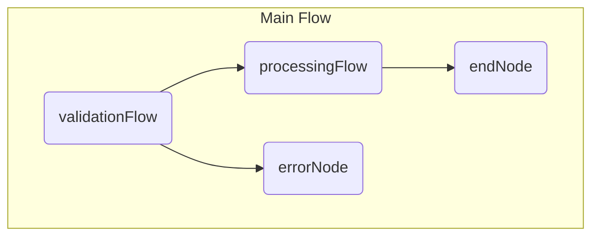

# Agentic Coding with PocketFlow-PHP

> **Attention AI Agent:** This is your primary instruction manual. Follow these rules strictly to generate correct, robust, and bug-free PHP code for the PocketFlow-PHP framework. Failure to adhere to these rules will result in errors.

## The Golden Rules

1.  **THE CORE FRAMEWORK IS READ-ONLY.** The file `src/PocketFlow.php` is the engine. You are **strictly forbidden** from ever editing it.

2.  **USE THE THREE MAIN FILES.** All your application code **must** be written in these three files in the project root:
    -   `nodes.php`: For all `Node`, `BatchNode`, and `AsyncNode` class definitions.
    -   `flow.php`: For functions that create and wire up `Flows`.
    -   `main.php`: The single entry point that calls a function from `flow.php`.

3.  **UTILITIES GO IN `utils/`.** Any function that communicates with the outside world (e.g., calling an LLM API, a database, or a web search) **must** be placed in a new file inside the `utils/` directory.

4.  **STATE MANAGEMENT IS CRITICAL.**
    -   **DO** use the `$shared` object (`stdClass`) to manage all **mutable application state** (e.g., results, counters, lists of items).
    -   **DO NOT** use `static` properties or variables inside Node classes to manage state. This will fail in loops.
    -   **DO NOT** use `$this->params` to store mutable state. It is for **immutable configuration** only.

5.  **STRICT TYPE COMPATIBILITY & SCOPE.**
    -   The `post()` method of a `Node` **must** have the return type `?string`. If it does not decide the next action, it **must** end with `return null;`.
    -   All `_async` methods (`prep_async`, `exec_async`, `post_async`) **must** have the return type `React\Promise\PromiseInterface`.
    -   To return a promise, **always** use the pattern `return async(function() { ... })();`. Do not forget the final `()`.
    -   **DO NOT** use `use ($this)` in closures. To access `$this->params` inside a `post_async` or `exec_async` closure, read the required values into local variables *before* the closure and pass them in with `use()`.

6.  **ALWAYS IMPORT CLASSES WITH `use`.**
    -   Any file that references a class (e.g., `AsyncNode`, `Flow`, `PromiseInterface`) **must** include a `use` statement for that class at the top of the file.

7.  **DEFINE NODE CONNECTIONS *BEFORE* CREATING THE FLOW.**
    -   The `Flow` class does not have a public method to retrieve its start node. Therefore, you **must** configure all node connections (`->next()`, `->on()->next()`) *before* passing the start node to the `Flow` constructor. This is especially important for creating loops.
    -   **Correct Pattern:**
        ```php
        $myStartNode = new MyNode();
        $nextNode = new NextNode();
        $myStartNode->on('continue')->next($myStartNode); // Define loop on the node itself
        $myStartNode->on('finish')->next($nextNode);
        $flow = new Flow($myStartNode); // Then create the flow with the fully wired node
        ```

8.  **USE PHP 8.3 FEATURES WISELY.**
    -   **DO** use constructor property promotion for cleaner `Node` classes.
    -   **DO** use the `match` expression inside `post()` for clean, readable action routing.
    -   **DO NOT** use features like Fibers directly. Rely on the `async()` and `await()` functions provided by `react/async`.

9.  **ENABLE STRICT TYPES.**
    -   To prevent common type-related errors, **every new PHP file** you create (`nodes.php`, `flow.php`, `main.php`, and all utility files) **must** start with the following declaration on the very first line:
        ```php
        <?php
        declare(strict_types=1);
        ```

10. **MANAGE DEPENDENCIES WITH COMPOSER COMMANDS.**
    -   You **must not** edit the `composer.json` file manually.
    -   When a new library is needed for a utility function (e.g., `symfony/yaml` for parsing YAML), you **must** instruct the user to run the `composer require` command.
    -   **Example Instruction:** "To parse YAML, the `symfony/yaml` package is required. Please run: `composer require symfony/yaml`"

## The Development Workflow

Follow these steps in order. Refer to the correct code examples in this documentation.
1.  **Human: Define Requirements.** The human provides a high-level goal.
    - > "Build a system that summarizes news articles from a list of URLs."

2.  **AI: Propose a Plan.** Based on the documentation, the AI proposes a plan using PocketFlow concepts.
    > "I will create a `BatchFlow` to process each URL. The sub-flow will have two nodes: `FetchArticleNode` to download the content, and `SummarizeNode` to call an LLM. The final summaries will be stored in `$shared->summaries`."

3.  **Human: Approve the Plan.** The human confirms the logic.

4.  **AI: Generate the Code.** The AI writes the code for `utils/`, `nodes.php`, `flow.php`, and `main.php`, strictly following the Golden Rules and the Mandatory Project Structure.

5.  **Human & AI: Test and Iterate.** The human runs `php main.php`. If there are errors, the AI debugs them by reviewing the Golden Rules.

This collaborative process, guided by this documentation, is the fastest and most reliable way to build LLM applications with PocketFlow-PHP.

## Mandatory Project Structure

Your final project **must** adhere to this structure. Do **not** create additional top-level directories or files, unless stated otherwise by the user, e.g. when asked to add a frontend.

/
├── main.php           # The application's single entry point.
├── nodes.php          # All Node class definitions.
├── flow.php           # All Flow creation functions.
├── utils/             # Directory for all helper functions (API calls, etc.).
│   └── ...            # e.g., llm_api.php, web_search.php
├── composer.json      # Managed by Composer. Do not edit manually.
└── src/
    └── PocketFlow.php # The core framework. READ-ONLY.

---

### 1: Introduction to PocketFlow-PHP 

# PocketFlow-PHP


  <strong>A minimalist LLM framework for PHP, written in 368 lines of PHP.</strong>
 
  Build complex Agents, Workflows, and RAG systems with a tiny, powerful core.


---

**PocketFlow-PHP** is a port of the minimalist Python LLM framework, bringing its core principles to the PHP ecosystem. It's designed for developers who want maximum control and flexibility without the bloat of larger frameworks. It is optimized for **Agentic Coding**, where humans design the system and an AI agent writes the code.

-   **Lightweight**: The entire framework core is in a single, well-tested file.
-   **Expressive**: Build everything you love from larger frameworks—Multi-Agent systems, RAG pipelines, and complex workflows—using simple, composable building blocks.

## How does it work?

The core abstraction is a **Graph + Shared Store**.

1.  **Node**: The smallest unit of work (e.g., call an LLM, read a file).
2.  **Flow**: Connects Nodes into a graph. Transitions are determined by simple string "Actions".
3.  **Shared Store**: A simple `stdClass` object passed through the entire flow, allowing nodes to communicate and share state.

This simple model is all you need to create powerful design patterns:

## Getting Started in 60 Seconds

Get up and running with your first AI-powered application.

**Prerequisites:** PHP 8.3+ and [Composer](https://getcomposer.org/) must be installed.

1.  **Clone the repository:**
    ```bash
    git clone https://github.com/weise25/PocketFlow-PHP.git
    cd PocketFlow-PHP
    ```

2.  **Install dependencies:**
    ```bash
    composer install
    ```

3.  **Set up your environment:**
    -   Create a `.env` file in the root of the project.
    -   Add your API keys to the `.env` file (e.g., `OPENROUTER_API_KEY=...`).

### Chapter 2: Core Abstraction

# Core Abstraction

This chapter explains the fundamental building blocks of **PocketFlow-PHP**. Understanding these concepts is essential for building any application with the framework.

We model the LLM workflow as a **Graph + Shared Store**.

-   [Node] – The smallest unit of work.
-   [Flow] – The orchestrator that connects Nodes.
-   [Communication] – How Nodes and Flows share data.
-   [Batch] – Tools for handling multiple items efficiently.
-   [(Advanced) Async] – For non-blocking, I/O-bound tasks.
-   [(Advanced) Parallel] – For running multiple async tasks concurrently.


---

### 2.1: Node

# Node

A **`Node`** is the smallest building block in PocketFlow. It represents a single, concrete step in a workflow. Each Node follows a simple, three-step lifecycle: `prep() -> exec() -> post()`.


### 1. The Lifecycle

1.  **`prep(stdClass $shared): mixed`**
    *   **Purpose:** To read data from the `$shared` store and prepare it for the main task.
    *   **Example:** Fetch a user ID from `$shared->user->id`.
    *   **Returns:** The data needed by the `exec()` method.

2.  **`exec(mixed $prepResult): mixed`**
    *   **Purpose:** To perform the core computation. This is where you call LLMs, APIs, or run business logic.
    *   **Rule:** This method **must not** access the `$shared` store directly. It should be a "pure" function that only works with the data it receives from `prep()`.
    *   **Returns:** The result of the computation.

3.  **`post(stdClass $shared, mixed $prepResult, mixed $execResult): ?string`**
    *   **Purpose:** To write the results from `exec()` back into the `$shared` store and to decide what happens next.
    *   **Returns:** An **action string**. This string determines which path the `Flow` will take. Returning `null` triggers the default path.
    *   > **AI Agent Rule:** The return type of this method **must** be `?string`. If you don't need to return a specific action, you **must** `return null;`.

### 2. Fault Tolerance

You can make your Nodes resilient to failure using constructor arguments and a fallback method.

**Retries:**
Define the number of retries and the wait time in the constructor.

```php
// nodes.php
use PocketFlow\Node;

class ApiCallNode extends Node
{
    public function __construct()
    {
        // Try exec() up to 3 times, wait 5 seconds between failures.
        parent::__construct(maxRetries: 3, wait: 5);
    }

    public function exec(mixed $prepResult): string
    {
        // This might throw an exception if the API is down.
        return call_external_api();
    }
}
```

**Graceful Fallback:**
If all retries fail, the `execFallback()` method is called. Instead of crashing, you can return a safe default value.

```php
// nodes.php
use PocketFlow\Node;

class ApiCallNode extends Node
{
    // ... constructor and exec() method ...

    public function execFallback(mixed $prepResult, \Throwable $e): string
    {
        // Log the error and return a safe default.
        error_log("API call failed after all retries: " . $e->getMessage());
        return "Default value due to API failure.";
    }
}
```

### 3. Example: A Complete Node

```php
// nodes.php
use PocketFlow\Node;

class SummarizeArticleNode extends Node
{
    public function __construct()
    {
        parent::__construct(maxRetries: 2, wait: 3);
    }

    public function prep(stdClass $shared): ?string
    {
        return $shared->article_text ?? null;
    }

    public function exec(mixed $articleText): string
    {
        if (empty($articleText)) {
            return "No text provided.";
        }
        $prompt = "Summarize this article: " . $articleText;
        return call_llm($prompt); // This might fail.
    }

    public function execFallback(mixed $prepResult, \Throwable $e): string
    {
        return "Could not generate summary due to an error.";
    }

    public function post(stdClass $shared, mixed $prepResult, mixed $execResult): ?string
    {
        $shared->summary = $execResult;
        return null; // Triggers the "default" action.
    }
}
```

--- 
## 2.2: Flow

A **`Flow`** is the orchestrator. It connects `Nodes` together to form a process graph. The path through the graph is determined by the **action strings** returned by each Node's `post()` method.

### 1. Action-Based Transitions

You define the connections between nodes using a simple, fluent API.

**Default Transition:**
If a Node's `post()` method returns `null` (or the string `"default"`), the default path is taken.

```php
// flow.php
$nodeA = new NodeA();
$nodeB = new NodeB();

// If NodeA returns null, execute NodeB next.
$nodeA->next($nodeB);

$flow = new Flow($nodeA);
```

**Conditional Transitions:**
You can create branches in your logic based on specific action strings.

```php
// flow.php
$reviewNode = new ReviewNode();
$approveNode = new ApproveNode();
$rejectNode = new RejectNode();

// If reviewNode returns "approved", go to approveNode.
$reviewNode->on('approved')->next($approveNode);

// If reviewNode returns "rejected", go to rejectNode.
$reviewNode->on('rejected')->next($rejectNode);

$flow = new Flow($reviewNode);
```

### 2. Nested Flows (Composition)

A `Flow` itself behaves like a `Node`. This allows you to build complex workflows by composing smaller, reusable flows.

When a `Flow` is used as a node, the action returned by the **last node** of that inner flow is used to determine the next step in the outer flow.

**Example:**

```php
// flow.php
use PocketFlow\Flow;

// --- Sub-Flow 1: User Validation ---
$checkUser = new CheckUserNode();
$checkPermissions = new CheckPermissionsNode();
$checkUser->next($checkPermissions);
$validationFlow = new Flow($checkUser); // This flow might return "validation_failed"

// --- Sub-Flow 2: Data Processing ---
$loadData = new LoadDataNode();
$processData = new ProcessDataNode();
$loadData->next($processData);
$processingFlow = new Flow($loadData); // This flow might return "processing_complete"

// --- Main Flow: Composing the sub-flows ---
$endNode = new EndNode();
$errorNode = new ErrorNode();

// Wire the main flow
$validationFlow->next($processingFlow); // Default transition
$validationFlow->on('validation_failed')->next($errorNode);
$processingFlow->on('processing_complete')->next($endNode);

$mainFlow = new Flow($validationFlow);
$mainFlow->run($shared);
```

This creates a clear, modular structure:

---

# 2.3: Communication

Nodes and Flows need to share data. PocketFlow provides two mechanisms for this, each with a distinct purpose.

### 1. The Shared Store (`$shared`)

This is the **primary** method of communication and state management.

-   **What it is:** A single `stdClass` object that is passed by reference to every Node in a Flow.
-   **Purpose:** To hold all **mutable application state**. This includes initial inputs, intermediate results, final outputs, counters, flags, etc.
-   **When to use:** For almost everything. It acts as the central "memory" or "database" for your workflow.
-   **How to use:**
    -   Read from it in `prep()`.
    -   Write to it in `post()`.

> **AI Agent Golden Rule:** The `$shared` store is the single source of truth for your application's state. Any data that changes or needs to be passed between nodes **must** live in `$shared`.

**Example:**

```php
// main.php
$shared = new stdClass();
$shared->user_id = 123;
$shared->user_data = null; // To be filled by a node
$shared->final_report = null; // To be filled by another node

$flow->run($shared);

// After the flow runs, $shared will be populated.
echo $shared->final_report;
```

### 2. Params (`$params`)

This is a **secondary** mechanism for configuration.

-   **What it is:** An `array` that is passed by value to each Node.
-   **Purpose:** To hold **immutable configuration** that does not change during the flow's execution.
-   **When to use:** For things like model names, API endpoints, or identifiers in a `BatchFlow`.
-   **How to use:**
    -   Set once on the top-level `Flow` using `$flow->setParams([...])`.
    -   Access within any Node via `$this->params['my_key']`.

> **AI Agent Warning:** Do not use `$params` to store state that needs to change (like counters or lists of results). The `$params` array is reset for each node in a loop, so any changes you make will be lost. Use `$shared` for that.

**Example:**

```php
// flow.php
$node = new ApiCallNode();
$flow = new Flow($node);

// Set the API endpoint once for the entire flow.
$flow->setParams(['api_endpoint' => 'https://api.example.com/v1']);
$flow->run($shared);

// nodes.php
class ApiCallNode extends Node
{
    public function exec(mixed $prepResult): string
    {
        $endpoint = $this->params['api_endpoint'];
        // ... make a call to the endpoint ...
        return "Data from API";
    }
}
```
---

### 2.4: Batch

# Batch Processing

PocketFlow provides two powerful classes for processing multiple items: `BatchNode` and `BatchFlow`.

### 1. `BatchNode`

Use `BatchNode` when you have a list of **data items** and want to perform the **same operation** on each one. This is the "Map" part of a Map-Reduce pattern.

**How it works:**
-   `prep(stdClass $shared)`: Must return an `array` of items to be processed.
-   `exec(mixed $item)`: Is called **sequentially** for each `$item` in the array from `prep()`.
-   `post(stdClass $shared, ..., array $execResultList)`: Receives an `array` containing the results of all `exec()` calls.

**Example: Summarize Text Chunks**

```php
// nodes.php
use PocketFlow\BatchNode;

class SummarizeChunksNode extends BatchNode
{
    public function prep(stdClass $shared): array
    {
        // Assume $shared->text_chunks is an array of strings.
        return $shared->text_chunks;
    }

    public function exec(mixed $chunk): string
    {
        // This method is called for each chunk.
        return call_llm("Summarize this chunk: " . $chunk);
    }

    public function post(stdClass $shared, mixed $p, mixed $summaries): ?string
    {
        // $summaries is an array of all the individual summaries.
        $shared->combined_summary = implode("\n", $summaries);
        return null;
    }
}
```

### 2. `BatchFlow`

Use `BatchFlow` when you want to run an entire **sub-flow** multiple times, each time with a different **configuration**.

**How it works:**
-   `prep(stdClass $shared)`: Must return an `array` of **parameter arrays**.
-   The sub-flow is executed once for each parameter array.
-   Inside the sub-flow's nodes, the parameters are available via `$this->params`.

**Example: Process Multiple Files**

```php
// flow.php
use PocketFlow\Flow;
use PocketFlow\BatchFlow;

function create_file_processing_flow(): Flow
{
    // The sub-flow that processes a single file.
    $loadFileNode = new LoadFileNode();
    $analyzeFileNode = new AnalyzeFileNode();
    $loadFileNode->next($analyzeFileNode);
    $singleFileFlow = new Flow($loadFileNode);

    // The BatchFlow that orchestrates the process.
    $allFilesFlow = new ProcessAllFilesBatchFlow($singleFileFlow);
    return $allFilesFlow;
}

// nodes.php
use PocketFlow\Node;
use PocketFlow\BatchFlow;

class ProcessAllFilesBatchFlow extends BatchFlow
{
    public function prep(stdClass $shared): array
    {
        // Returns an array of parameter sets.
        // e.g., [['filename' => 'a.txt'], ['filename' => 'b.txt']]
        return array_map(fn($f) => ['filename' => $f], $shared->filenames);
    }
}

class LoadFileNode extends Node
{
    public function exec(mixed $p): string
    {
        // Accesses the filename from the params set by the BatchFlow.
        $filename = $this->params['filename'];
        echo "Loading file: {$filename}\n";
        return file_get_contents($filename);
    }
    
    public function post(stdClass $shared, mixed $p, mixed $content): ?string
    {
        $shared->current_content = $content;
        return null;
    }
}

class AnalyzeFileNode extends Node { /* ... analyzes $shared->current_content ... */ }
```
---

### Seite 2.5: (Advanced) Async
# (Advanced) Async

Use `AsyncNode` and `AsyncFlow` for tasks that are **I/O-bound**, such as API calls, database queries, or reading large files. This allows your application to perform other work while waiting for these operations to complete, making it much more efficient. All async operations are powered by **ReactPHP**.

### 1. `AsyncNode`

An `AsyncNode` is similar to a regular `Node`, but its lifecycle methods are asynchronous.

**Rules for `AsyncNode`:**
1.  Implement the `_async` versions of the lifecycle methods: `prep_async()`, `exec_async()`, `post_async()`.
2.  Each of these methods **must** return a `React\Promise\PromiseInterface`.
3.  The easiest way to return a promise is to wrap your logic in `return async(function() { ... })();`.
4.  Inside an `async` block, you can use `await()` to wait for other promises to resolve.

**Example: Asynchronous API Call**

```php
// nodes.php
use PocketFlow\AsyncNode;
use React\Promise\PromiseInterface;
use function React\Async\async;
use function React\Async\await;

class FetchUserDataNode extends AsyncNode
{
    public function prep_async(stdClass $shared): PromiseInterface
    {
        return async(fn() => $shared->user_id)();
    }

    public function exec_async(mixed $userId): PromiseInterface
    {
        // Assume call_user_api_async() returns a Promise.
        return call_user_api_async($userId);
    }

    public function post_async(stdClass $shared, mixed $p, mixed $userData): PromiseInterface
    {
        return async(function() use ($shared, $userData) {
            $shared->user_data = $userData;
            return null;
        })();
    }
}
```

### 2. `AsyncFlow`

An `AsyncFlow` is used to orchestrate flows that contain at least one `AsyncNode`. It can also correctly orchestrate regular synchronous `Nodes`.

### 3. Running an Async Workflow

The top-level entry point of any application that uses async features **must** be wrapped in an `async` block.

**Example:**

```php
// main.php
require_once __DIR__ . '/vendor/autoload.php';
require_once __DIR__ . '/flow.php';
use function React\Async\async;
use function React\Async\await;

// Wrap the entire application logic in async().
async(function() {
    $shared = new stdClass();
    $shared->user_id = 123;

    $flow = create_user_data_flow(); // This flow returns an AsyncFlow

    // Use await() to run the flow and wait for it to complete.
    await($flow->run_async($shared));

    print_r($shared->user_data);
})();
```
---

### 2.6: (Advanced) Parallel

# (Advanced) Parallel Execution

Parallel execution in PocketFlow-PHP means running multiple **asynchronous** tasks **concurrently**. This is extremely useful for speeding up I/O-bound workflows where tasks don't depend on each other.

> **Note:** This is **concurrency**, not true parallelism. PHP's single-threaded nature means CPU-bound tasks won't run faster. However, for waiting on multiple API calls or database queries at once, the performance gain is significant.

### 1. `AsyncParallelBatchNode`

This is the parallel version of `AsyncBatchNode`. It calls `exec_async()` for **all items at the same time** and waits for all of them to complete.

**Use Case:** Fetching data for multiple users from an API simultaneously.

**Example: Parallel API Calls**

```php
// nodes.php
use PocketFlow\AsyncParallelBatchNode;
use React\Promise\PromiseInterface;
use function React\Async\async;

class FetchAllUsersNode extends AsyncParallelBatchNode
{
    public function prep_async(stdClass $shared): PromiseInterface
    {
        // Returns an array of user IDs.
        return async(fn() => $shared->user_ids)();
    }

    public function exec_async(mixed $userId): PromiseInterface
    {
        // This is called concurrently for all user IDs.
        // Assume call_user_api_async() returns a Promise.
        return call_user_api_async($userId);
    }

    public function post_async(stdClass $shared, mixed $p, mixed $usersData): PromiseInterface
    {
        return async(function() use ($shared, $usersData) {
            // $usersData is an array of results. The order is preserved.
            $shared->users = $usersData;
            return null;
        })();
    }
}
```

### 2. `AsyncParallelBatchFlow`

This is the parallel version of `AsyncBatchFlow`. It runs the entire sub-flow for **all parameter sets concurrently**.

**Use Case:** Processing multiple files, where each file requires a multi-step async workflow (e.g., download, analyze, upload).

**Example: Parallel File Processing**

```php
// flow.php
use PocketFlow\AsyncFlow;
use PocketFlow\AsyncParallelBatchFlow;

function create_parallel_file_flow(): AsyncFlow
{
    // The sub-flow for a single file.
    $downloadNode = new DownloadFileAsyncNode();
    $analyzeNode = new AnalyzeFileAsyncNode();
    $downloadNode->next($analyzeNode);
    $singleFileFlow = new AsyncFlow($downloadNode);

    // The parallel batch flow.
    $parallelFlow = new ProcessAllFilesParallelBatchFlow($singleFileFlow);
    return $parallelFlow;
}

// nodes.php
use PocketFlow\AsyncParallelBatchFlow;
use React\Promise\PromiseInterface;
use function React\Async\async;

class ProcessAllFilesParallelBatchFlow extends AsyncParallelBatchFlow
{
    public function prep_async(stdClass $shared): PromiseInterface
    {
        // Returns an array of parameter sets.
        return async(fn() => array_map(fn($f) => ['url' => $f], $shared->file_urls))();
    }
}

// DownloadFileAsyncNode and AnalyzeFileAsyncNode are defined as regular AsyncNodes.
// They will access the URL via $this->params['url'].
```

> **Warning:** Be mindful of API rate limits when using parallel execution. A large number of concurrent requests can quickly exhaust your quota.

# Chapter 3: Design Pattern

# Design Patterns

Design patterns are reusable blueprints for solving common problems in LLM application development. PocketFlow-PHP's simple core abstractions (`Node`, `Flow`, `Shared Store`) are all you need to implement these powerful patterns.

This chapter provides practical, copy-paste-ready examples for each pattern.

-   [Agent] – For creating autonomous, decision-making entities.
-   [Workflow] – For breaking down complex tasks into a sequence of simple steps.
-   [RAG (Retrieval-Augmented Generation)] – For providing external knowledge to an LLM.
-   [Map-Reduce] – For processing large amounts of data efficiently.
-   [Structured Output] – For forcing an LLM to return clean, predictable data formats.
-   [(Advanced) Multi-Agent Systems] – For orchestrating collaboration between multiple specialized agents.
---

### Seite 3.1: Agent

# Agent

An **Agent** is a `Node` that can make autonomous decisions. Instead of following a fixed path, it analyzes the current state in the `$shared` store and returns a specific **action string** to direct the `Flow` down different branches, often looping back to itself to create a cycle of reasoning and action.

### The Agentic Loop

The core of an agent is a loop:
1.  **Think:** The Agent `Node` analyzes the state (`$shared`) and the goal.
2.  **Decide:** It calls an LLM to choose the next `action` from a predefined set of tools.
3.  **Act:** The `Flow` routes to a `Tool Node` based on the chosen action.
4.  **Observe:** The `Tool Node` executes its task (e.g., a web search) and updates the `$shared` store with the result.
5.  The `Flow` loops back to the Agent `Node` to start the cycle again with new information.

```mermaid
graph TD
    A[Agent Node (Think & Decide)] -- action: 'search' --> B[Search Tool Node (Act)];
    A -- action: 'answer' --> C[Answer Node (Final Act)];
    B -- result --> D(Update Shared Store);
    D --> A;
```

### Example: A Simple Research Agent

This agent can decide whether to search the web for more information or to answer a question based on the context it has already gathered.

**`flow.php`**
```php
<?php
require_once __DIR__ . '/nodes.php';
use PocketFlow\Flow;

function create_research_agent_flow(): Flow
{
    $decideNode = new DecideActionNode();
    $searchNode = new SearchWebNode();
    $answerNode = new AnswerNode();

    // Define the agent's decision branches and the loop
    $decideNode->on('search')->next($searchNode);
    $decideNode->on('answer')->next($answerNode);
    $searchNode->next($decideNode); // Loop back to the decision node after acting

    return new Flow($decideNode);
}
```

**`nodes.php`**
```php
<?php
require_once __DIR__ . '/vendor/autoload.php';
// require_once __DIR__ . '/utils/llm_api.php';
// require_once __DIR__ . '/utils/web_search.php';
use PocketFlow\Node;
use Symfony\Component\Yaml\Yaml; // `composer require symfony/yaml`

class DecideActionNode extends Node
{
    public function prep(stdClass $shared): array
    {
        $context = empty($shared->search_history) ? "Nothing yet." : implode("\n", $shared->search_history);
        return [$shared->query, $context];
    }

    public function exec(mixed $prepResult): array
    {
        [$query, $context] = $prepResult;
        $prompt = <<<PROMPT
        Your goal is to answer the user's query: "{$query}"
        You have already gathered this information:
        ---
        {$context}
        ---
        Based on this, do you have enough information to answer, or do you need to search the web?
        Respond in YAML format with your reasoning.

        ```yaml
        thinking: "Your reasoning here..."
        action: "search" or "answer"
        search_term: "Your search query here, if action is search"
        ```
        PROMPT;

        $response = call_llm($prompt); // Assume call_llm() is defined
        preg_match('/```yaml\s*(.*?)\s*```/s', $response, $matches);
        return Yaml::parse($matches[1] ?? '');
    }

    public function post(stdClass $shared, mixed $p, mixed $decision): ?string
    {
        if ($decision['action'] === 'search') {
            $shared->current_search_term = $decision['search_term'];
        }
        return $decision['action'];
    }
}

class SearchWebNode extends Node
{
    public function prep(stdClass $shared): string
    {
        return $shared->current_search_term;
    }

    public function exec(mixed $searchTerm): string
    {
        echo "Agent is searching for: {$searchTerm}\n";
        return web_search($searchTerm); // Assume web_search() is defined
    }

    public function post(stdClass $shared, mixed $p, mixed $searchResult): ?string
    {
        $shared->search_history[] = $searchResult;
        return null; // Triggers default transition back to DecideActionNode
    }
}

class AnswerNode extends Node
{
    public function exec(mixed $p): string
    {
        // In a real app, this would also use prep() to get context
        return "This is the final answer based on the research.";
    }

    public function post(stdClass $shared, mixed $p, mixed $answer): ?string
    {
        $shared->final_answer = $answer;
        return null; // End of flow
    }
}
```
---

### Chapter 3.2 - 3.6 (Workflow, RAG, etc.)

# Workflow

A **Workflow** is the simplest design pattern. It involves chaining a sequence of `Nodes` together to break a complex task into manageable steps. Each node performs one part of the job and passes its result to the next via the `$shared` store.

### Example: Article Writing Workflow

This workflow generates an article by breaking the process into three distinct steps: outlining, drafting, and reviewing.

**`flow.php`**
```php
<?php
require_once __DIR__ . '/nodes.php';
use PocketFlow\Flow;

function create_article_workflow(): Flow
{
    $outlineNode = new GenerateOutlineNode();
    $draftNode = new DraftArticleNode();
    $reviewNode = new ReviewArticleNode();

    // A simple, linear chain of nodes
    $outlineNode->next($draftNode)->next($reviewNode);

    return new Flow($outlineNode);
}
```

**`nodes.php`**
```php
<?php
use PocketFlow\Node;

class GenerateOutlineNode extends Node {
    public function prep(stdClass $shared): string { return $shared->topic; }
    public function exec(mixed $topic): string { return "Outline for: {$topic}"; /* call_llm(...) */ }
    public function post(stdClass $shared, mixed $p, mixed $outline): ?string {
        $shared->outline = $outline;
        return null;
    }
}

class DraftArticleNode extends Node {
    public function prep(stdClass $shared): string { return $shared->outline; }
    public function exec(mixed $outline): string { return "Draft based on: {$outline}"; /* call_llm(...) */ }
    public function post(stdClass $shared, mixed $p, mixed $draft): ?string {
        $shared->draft = $draft;
        return null;
    }
}

class ReviewArticleNode extends Node {
    public function prep(stdClass $shared): string { return $shared->draft; }
    public function exec(mixed $draft): string { return "Reviewed draft: {$draft}"; /* call_llm(...) */ }
    public function post(stdClass $shared, mixed $p, mixed $final): ?string {
        $shared->final_article = $final;
        return null;
    }
}
```

# RAG (Retrieval-Augmented Generation)

RAG allows an LLM to answer questions using information from your own documents. It's a two-stage process.

### Stage 1: Offline Indexing (A Workflow)

This flow reads documents, splits them into chunks, creates vector embeddings for each chunk, and stores them in a vector database.

**`flow.php` (Offline Indexing)**
```php
<?php
use PocketFlow\Flow;

function create_indexing_flow(): Flow
{
    $chunkNode = new ChunkFilesNode();
    $embedNode = new EmbedChunksNode();
    $storeNode = new StoreEmbeddingsNode();

    $chunkNode->next($embedNode)->next($storeNode);
    return new Flow($chunkNode);
}
```

**`nodes.php` (Offline Indexing)**
```php
<?php
use PocketFlow\BatchNode;
use PocketFlow\Node;

// 1. Chunking (using BatchNode)
class ChunkFilesNode extends BatchNode {
    public function prep(stdClass $shared): array { return $shared->file_paths; }
    public function exec(mixed $path): array { return sentence_chunk(file_get_contents($path)); }
    public function post(stdClass $shared, mixed $p, mixed $chunkLists): ?string {
        $shared->all_chunks = array_merge(...$chunkLists);
        return null;
    }
}

// 2. Embedding (using BatchNode)
class EmbedChunksNode extends BatchNode {
    public function prep(stdClass $shared): array { return $shared->all_chunks; }
    public function exec(mixed $chunk): array { return get_embedding($chunk); } // Assume get_embedding() exists
    public function post(stdClass $shared, mixed $p, mixed $embeddings): ?string {
        $shared->embeddings = $embeddings;
        return null;
    }
}

// 3. Storing
class StoreEmbeddingsNode extends Node {
    public function exec(mixed $p): mixed {
        /* ... code to store embeddings in a vector DB ... */
        return null; // Must return a value compatible with 'mixed'
    }
}
```

### Stage 2: Online Retrieval & Answering (A Workflow)

This flow takes a user's question, finds the most relevant chunks from the vector database, and passes them to an LLM as context to generate an answer.

**`flow.php` (Online Answering)**
```php
<?php
use PocketFlow\Flow;

function create_rag_answer_flow(): Flow
{
    $embedQuery = new EmbedQueryNode();
    $retrieveDocs = new RetrieveDocsNode();
    $generateAnswer = new GenerateAnswerNode();

    $embedQuery->next($retrieveDocs)->next($generateAnswer);
    return new Flow($embedQuery);
}
```

# Map-Reduce

The Map-Reduce pattern is perfect for processing large datasets that can be broken down into smaller, independent parts.

-   **Map Phase:** A `BatchNode` processes each part of the data individually.
-   **Reduce Phase:** A regular `Node` takes the list of results from the map phase and combines them into a single, final output.

### Example: Summarizing Multiple Documents

**`flow.php`**
```php
<?php
use PocketFlow\Flow;

function create_map_reduce_summary_flow(): Flow
{
    $mapNode = new MapSummarizeFilesNode();
    $reduceNode = new ReduceSummariesNode();

    $mapNode->next($reduceNode);
    return new Flow($mapNode);
}
```

**`nodes.php`**
```php
<?php
use PocketFlow\BatchNode;
use PocketFlow\Node;

// MAP: Summarize each document
class MapSummarizeFilesNode extends BatchNode
{
    public function prep(stdClass $shared): array
    {
        // $shared->documents is an associative array ['filename' => 'content', ...]
        return $shared->documents;
    }

    public function exec(mixed $content): string
    {
        return call_llm("Summarize this document: " . $content);
    }

    public function post(stdClass $shared, mixed $p, mixed $summaries): ?string
    {
        $shared->individual_summaries = $summaries;
        return null;
    }
}

// REDUCE: Combine all summaries into one
class ReduceSummariesNode extends Node
{
    public function prep(stdClass $shared): array
    {
        return $shared->individual_summaries;
    }

    public function exec(mixed $summaries): string
    {
        $combinedText = implode("\n---\n", $summaries);
        return call_llm("Create a final summary from these smaller summaries: " . $combinedText);
    }

    public function post(stdClass $shared, mixed $p, mixed $finalSummary): ?string
    {
        $shared->final_summary = $finalSummary;
        return null;
    }
}
```

# Structured Output

Often, you need an LLM to return data in a specific format like JSON or an array. The most reliable way to achieve this is through **prompt engineering**.

### The YAML Technique

YAML is often easier for LLMs to generate correctly than JSON because it is less strict about quotes and commas.

**The Strategy:**
1.  In your prompt, provide a clear example of the YAML structure you expect.
2.  Wrap the example in ```yaml code blocks.
3.  In your `exec()` method, parse the YAML string from the LLM's response.

### Example: Extracting Information from Text

```php
// nodes.php
use PocketFlow\Node;
use Symfony\Component\Yaml\Yaml; // `composer require symfony/yaml`

class ExtractUserInfoNode extends Node
{
    public function prep(stdClass $shared): string
    {
        return $shared->raw_text; // e.g., "John Doe is 30 years old and lives in New York."
    }

    public function exec(mixed $text): array
    {
        $prompt = <<<PROMPT
        Extract the user's name, age, and city from the following text.
        Return the result in YAML format inside a code block.

        Text: "{$text}"

        ```yaml
        user:
          name: "Full Name"
          age: integer
          city: "City Name"
        ```
        PROMPT;

        $response = call_llm($prompt);
        preg_match('/```yaml\s*(.*?)\s*```/s', $response, $matches);
        $data = Yaml::parse($matches[1] ?? '');

        // Validate the structure
        assert(isset($data['user']['name']));

        return $data['user'];
    }

    public function post(stdClass $shared, mixed $p, mixed $userInfo): ?string
    {
        $shared->user_info = $userInfo;
        return null;
    }
}
```

# (Advanced) Multi-Agent Systems

A Multi-Agent System involves two or more autonomous `Agents` collaborating to solve a problem. In PocketFlow-PHP, this is achieved by running multiple `AsyncFlows` concurrently, with agents communicating via shared **message queues**.

### The Core Pattern

1.  **One Flow per Agent:** Each agent's logic is contained in its own `AsyncNode`, which runs in a loop inside its own `AsyncFlow`.
2.  **Message Queues:** A simple, promise-based queue class is used for communication. Queues are stored in the `$shared` object.
3.  **Concurrent Execution:** All agent flows are started simultaneously using `React\Promise\all()`.
4.  **State Management:**
    -   **Immutable Config:** Agent-specific configuration (like model name or personality prompt) is passed via `$params`.
    -   **Mutable State:** Shared game state (like scores or history) is managed in the `$shared` object.

### Example: The Taboo Game

This example features a "Hinter" agent and a "Guesser" agent playing the word game Taboo.

**`flow.php`**
```php
<?php
// ... use statements ...

function create_taboo_game_flow(): void {
    async(function() {
        // 1. Initialize shared state, including queues
        $shared = new stdClass();
        $shared->hinterQueue = new MessageQueue();
        $shared->guesserQueue = new MessageQueue();
        $shared->past_guesses = [];
        $shared->guess_count = 0;

        // 2. Create and configure agent nodes and flows
        $hinterNode = new HinterAgent();
        $guesserNode = new GuesserAgent();

        $hinterNode->on('continue')->next($hinterNode); // Loop
        $guesserNode->on('continue')->next($guesserNode); // Loop

        $hinterFlow = new AsyncFlow($hinterNode);
        $guesserFlow = new AsyncFlow($guesserNode);
        
        // ... set params for each flow ...

        // 3. Start the game and run flows concurrently
        $shared->hinterQueue->put("START");
        await(\React\Promise\all([
            $hinterFlow->run_async($shared),
            $guesserFlow->run_async($shared)
        ]));
    })();
}
```

**`nodes.php`**
```php
<?php
// ... use statements ...

class MessageQueue { /* ... implementation ... */ }

class HinterAgent extends AsyncNode {
    public function prep_async(stdClass $shared): PromiseInterface {
        return $shared->hinterQueue->get(); // Wait for a message
    }
    public function exec_async(mixed $message): PromiseInterface {
        // ... generate a hint based on the message ...
    }
    public function post_async(stdClass $shared, mixed $p, mixed $hint): PromiseInterface {
        return async(function() use ($shared, $hint) {
            $shared->guesserQueue->put($hint); // Send hint to the other agent
            return "continue";
        })();
    }
}

class GuesserAgent extends AsyncNode {
    public function prep_async(stdClass $shared): PromiseInterface {
        return $shared->guesserQueue->get(); // Wait for a hint
    }
    // ... exec and post methods to make a guess and send it back ...
}
```

---

### 4: Utility Function 

# Utility Functions

PocketFlow-PHP intentionally does not include built-in wrappers for external APIs. This "bring your own" philosophy gives you maximum flexibility and avoids vendor lock-in.

This chapter provides simple, copy-paste-ready snippets for common utility functions. Place these functions in new files inside your `utils/` directory (e.g., `utils/llm_api.php`).

-   [LLM Wrapper]
-   [Viz and Debug]
-   [Web Search]
-   [Text Chunking]
-   [Embedding]
-   [Vector Databases]
-   [Text to Speech]

---

### 4.1 - 4.7 (Utility Function Examples Pages)

# LLM Wrapper

A centralized function to handle all your LLM API calls is a best practice.

### Recommended Client: `openai-php/client`

This client is compatible with any OpenAI-compliant API, including OpenRouter, DeepSeek, and many local models.

**`utils/llm_api.php`**
```php
<?php
require_once __DIR__ . '/../vendor/autoload.php';

use OpenAI\Client;
use React\Promise\PromiseInterface;
use function React\Async\async;

function get_openrouter_client(): Client
{
    return OpenAI::factory()
        ->withApiKey(getenv('OPENROUTER_API_KEY'))
        ->withBaseUri('https://openrouter.ai/api/v1')
        ->withHttpHeader('HTTP-Referer', 'http://localhost') // Required by OpenRouter
        ->withHttpHeader('X-Title', 'PocketFlow-PHP')
        ->make();
}

function call_llm_async(string $model, array $messages): PromiseInterface
{
    return async(function () use ($model, $messages) {
        try {
            $client = get_openrouter_client();
            $response = $client->chat()->create([
                'model' => $model,
                'messages' => $messages,
            ]);
            return $response->choices[0]->message->content;
        } catch (\Exception $e) {
            error_log("API Error: " . $e->getMessage());
            return "Error communicating with the LLM.";
        }
    })();
}
```

# Visualization and Debugging

Simple helpers can make debugging complex flows much easier.

### Mermaid Graph Generator

This function traverses a `Flow` and generates a Mermaid syntax string, which you can paste into any Mermaid renderer to visualize your graph.

**`utils/visualize.php`**
```php
<?php
use PocketFlow\BaseNode;
use PocketFlow\Flow;

function generate_mermaid_graph(BaseNode $startNode): string
{
    $dot = "graph TD\n";
    $nodes = new \SplObjectStorage();
    $queue = new \SplQueue();
    $queue->enqueue($startNode);
    $nodes[$startNode] = "N" . ($nodes->count() + 1);

    while (!$queue->isEmpty()) {
        $current = $queue->dequeue();
        $currentId = $nodes[$current];
        $className = (new \ReflectionClass($current))->getShortName();
        $dot .= "    {$currentId}[\"{$className}\"]\n";

        foreach ($current->getSuccessors() as $action => $successor) {
            if (!$successor) continue;
            if (!$nodes->contains($successor)) {
                $nodes[$successor] = "N" . ($nodes->count() + 1);
                $queue->enqueue($successor);
            }
            $successorId = $nodes[$successor];
            $dot .= "    {$currentId} -- \"{$action}\" --> {$successorId}\n";
        }
    }
    return $dot;
}
```

# Web Search

A simple wrapper for a web search API. The DuckDuckGo API is free and requires no API key, making it great for testing.

**`utils/web_search.php`**
```php
<?php
function web_search(string $query): string
{
    $url = 'https://api.duckduckgo.com/?q=' . urlencode($query) . '&format=json&pretty=1';
    $options = ['http' => ['header' => "User-Agent: PocketFlow-PHP/1.0\r\n"]];
    $context = stream_context_create($options);
    $response = @file_get_contents($url, false, $context);
    
    if ($response === false) {
        return "Error fetching search results.";
    }
    
    $data = json_decode($response, true);
    return $data['AbstractText'] ?? 'No results found.';
}
```

# Text Chunking

Breaking large texts into smaller, manageable chunks is a core task in RAG systems.

**`utils/chunking.php`**
```php
<?php
/**
 * Splits text into sentences.
 */
function sentence_chunk(string $text): array
{
    return preg_split('/(?<=[.!?])\s+/', $text, -1, PREG_SPLIT_NO_EMPTY);
}

/**
 * Splits text into paragraphs.
 */
function paragraph_chunk(string $text): array
{
    return preg_split('/\n\s*\n/', $text, -1, PREG_SPLIT_NO_EMPTY);
}
```

# Embedding

Creating vector embeddings from text is the first step in most RAG and semantic search applications.

**`utils/embedding.php`**
```php
<?php
use React\Promise\PromiseInterface;
use function React\Async\async;

function get_embedding_async(string $text, string $model = 'openai/text-embedding-3-small'): PromiseInterface
{
    return async(function() use ($text, $model) {
        // This uses the same OpenRouter client as the LLM wrapper
        $client = get_openrouter_client();
        $response = $client->embeddings()->create([
            'model' => $model,
            'input' => $text,
        ]);
        return $response->embeddings[0]->embedding;
    })();
}
```
# Vector Databases

Storing and retrieving embeddings requires a vector database. Here is a very simple in-memory example for prototyping. For production, use a dedicated service like Pinecone, Qdrant, or Redis.

**`utils/memory_vector_store.php`**
```php
<?php
class MemoryVectorStore
{
    private array $vectors = [];
    private array $metadata = [];

    public function add(string $id, array $vector, mixed $meta): void
    {
        $this->vectors[$id] = $vector;
        $this->metadata[$id] = $meta;
    }

    public function search(array $queryVector, int $topK = 1): array
    {
        $distances = [];
        foreach ($this->vectors as $id => $vector) {
            // Cosine similarity calculation
            $dotProduct = 0;
            $normA = 0;
            $normB = 0;
            for ($i = 0; $i < count($vector); $i++) {
                $dotProduct += $queryVector[$i] * $vector[$i];
                $normA += $queryVector[$i] ** 2;
                $normB += $vector[$i] ** 2;
            }
            $similarity = $dotProduct / (sqrt($normA) * sqrt($normB));
            $distances[$id] = $similarity;
        }

        arsort($distances); // Sort by similarity, descending
        
        $results = [];
        foreach (array_slice($distances, 0, $topK, true) as $id => $score) {
            $results[] = [
                'id' => $id,
                'score' => $score,
                'metadata' => $this->metadata[$id]
            ];
        }
        return $results;
    }
}
```
# Text to Speech (TTS)

Generate audio from text using a TTS service like ElevenLabs.

**`utils/tts.php`**
```php
<?php
use GuzzleHttp\Client; // `composer require guzzlehttp/guzzle`

function text_to_speech(string $text, string $outputFilePath): void
{
    $client = new Client();
    $apiKey = getenv('ELEVENLABS_API_KEY');
    $voiceId = '21m00Tcm4TlvDq8ikWAM'; // Example voice ID

    try {
        $response = $client->post("https://api.elevenlabs.io/v1/text-to-speech/{$voiceId}", [
            'headers' => [
                'Accept' => 'audio/mpeg',
                'Content-Type' => 'application/json',
                'xi-api-key' => $apiKey,
            ],
            'json' => [
                'text' => $text,
                'model_id' => 'eleven_monolingual_v1',
            ],
            'sink' => $outputFilePath // Stream response directly to a file
        ]);
        echo "Audio saved to {$outputFilePath}\n";
    } catch (\Exception $e) {
        echo "Error generating audio: " . $e->getMessage() . "\n";
    }
}
```
