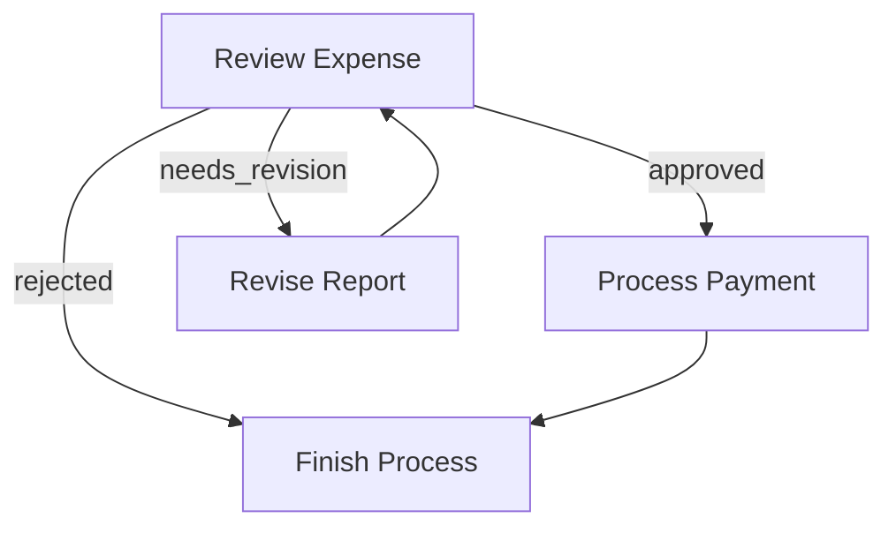
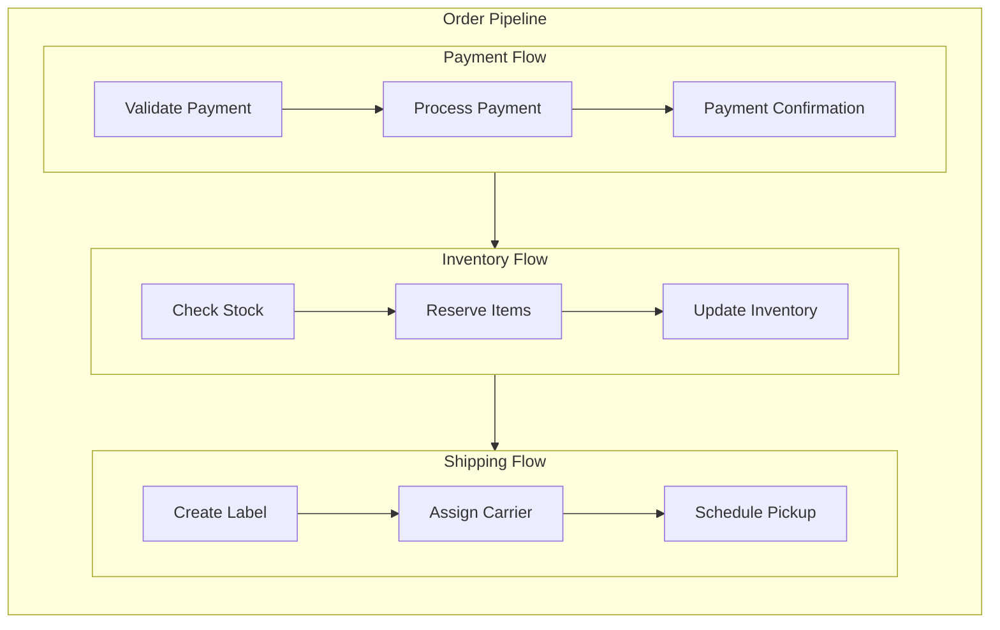

# Agentic Coding: Humans Design, Agents code!

> If you are an AI agent involved in building LLM Systems, read this guide **VERY, VERY** carefully! This is the most important chapter in the entire document. Throughout development, you should always (1) start with a small and simple solution, (2) design at a high level (`docs/design.md`) before implementation, and (3) frequently ask humans for feedback and clarification.
{: .warning }


## The Golden Rules

1.  **THE CORE FRAMEWORK IS READ-ONLY.** The file `src/PocketFlow.php` is the engine. You are **strictly forbidden** from ever editing or suggesting edits to this file. The `src/` directory is a **read-only** zone.

2.  **USE THE THREE MAIN FILES.** All your application code **must** be written in these three files in the project root:
    -   `nodes.php`: For all `Node`, `BatchNode`, and `AsyncNode` class definitions.
    -   `flow.php`: For functions that create and wire up `Flows`.
    -   `main.php`: The single entry point that calls a function from `flow.php`.

3.  **UTILITIES GO IN `utils/`.** Any function that communicates with the outside world (e.g., calling an LLM API, a database, or a web search) **must** be placed in its own, separate file inside the `utils/` directory (e.g., `utils/llm_api.php`, `utils/database_connector.php`).

4.  **STATE MANAGEMENT IS CRITICAL.**
    -   **DO** use the `$shared` object (`stdClass`) to manage all mutable application state (e.g., results, counters, lists of items).
    -   **DO NOT** use `static` properties or variables inside Node classes to manage state. This will fail in loops.
    -   **DO NOT** use `$this->params` to store mutable state. It is for immutable configuration only.

5.  **STRICT TYPE COMPATIBILITY.**
    -   The `post()` method of a `Node` **must** have the return type `?string`. If it does not decide the next action, it **must** end with `return null;`.
    -   All `_async` methods (`prep_async`, `exec_async`, `post_async`) **must** have the return type `React\Promise\PromiseInterface`.
    -   To return a promise, **always** use the pattern `return async(function() { ... })();`. Do not forget the final `()`.

6.  **ALWAYS IMPORT CLASSES WITH `use`.**
    -   Any file that references a class (e.g., `AsyncNode`, `Flow`, `PromiseInterface`) **must** include a `use` statement for that class at the top of the file.
    -   This is especially important in `flow.php` and `nodes.php`, even for classes from the core framework or vendor packages.

7.  **DO NOT CALL `startNode()`.**
    -   The `Flow` class **does not have** a public `startNode()` method.
    -   **Correct Pattern:** To reference the start node (e.g., for a loop), store it in a variable *before* creating the flow.
    -   **CORRECT:** `$myNode->on('continue')->next($myNode); $flow = new Flow($myNode);`

8.  **RESPECT CLOSURE SCOPE.**
    -   To use a property of `$this` (like `$this->params`) inside a closure, read it into a local variable *before* the closure, then pass that variable into the closure with `use()`.
    -   **CORRECT:**
        ```php
        public function my_method(): PromiseInterface {
            $key_from_params = $this->params['key']; // Read value outside
            return async(function() use ($key_from_params) { // Pass value in
                $value = $key_from_params; // Use the local variable
            })();
        }
        ```

---

## Agentic Coding Steps

Agentic Coding should be a collaboration between Human System Design and Agent Implementation:

| Steps                  | Human      | AI        | Comment                                                                 |
|:-----------------------|:----------:|:---------:|:------------------------------------------------------------------------|
| 1. Requirements | ★★★ High  | ★☆☆ Low   | Humans understand the requirements and context.                    |
| 2. Flow          | ★★☆ Medium | ★★☆ Medium |  Humans specify the high-level design, and the AI fills in the details. |
| 3. Utilities   | ★★☆ Medium | ★★☆ Medium | Humans provide available external APIs and integrations, and the AI helps with implementation. |
| 4. Data          | ★☆☆ Low    | ★★★ High   | AI designs the data schema, and humans verify.                            |
| 5. Node          | ★☆☆ Low   | ★★★ High  | The AI helps design the node based on the flow.          |
| 6. Implementation      | ★☆☆ Low   | ★★★ High  |  The AI implements the flow based on the design. |
| 7. Optimization        | ★★☆ Medium | ★★☆ Medium | Humans evaluate the results, and the AI helps optimize. |
| 8. Reliability         | ★☆☆ Low   | ★★★ High  |  The AI writes test cases and addresses corner cases.     |

1. **Requirements**: Clarify the requirements for your project, and evaluate whether an AI system is a good fit. 
    - Understand AI systems' strengths and limitations:
      - **Good for**: Routine tasks requiring common sense (filling forms, replying to emails)
      - **Good for**: Creative tasks with well-defined inputs (building slides, writing SQL)
      - **Not good for**: Ambiguous problems requiring complex decision-making (business strategy, startup planning)
    - **Keep It User-Centric:** Explain the "problem" from the user's perspective rather than just listing features.
    - **Balance complexity vs. impact**: Aim to deliver the highest value features with minimal complexity early.

2. **Flow Design**: Outline at a high level, describe how your AI system orchestrates nodes.
    - Identify applicable design patterns (e.g., Map Reduce, Agent, RAG).
      - For each node in the flow, start with a high-level one-line description of what it does.
      - If using **Map Reduce**, specify how to map (what to split) and how to reduce (how to combine).
      - If using **Agent**, specify what are the inputs (context) and what are the possible actions.
      - If using **RAG**, specify what to embed, noting that there's usually both offline (indexing) and online (retrieval) workflows.
    - Outline the flow and draw it in a mermaid diagram. For example:
      ```mermaid
      flowchart LR
          start[Start] --> batch[Batch]
          batch --> check[Check]
          check -->|OK| process
          check -->|Error| fix[Fix]
          fix --> check
          
          subgraph process[Process]
            step1[Step 1] --> step2[Step 2]
          end
          
          process --> endNode[End]
      ```
    - > **If Humans can't specify the flow, AI Agents can't automate it!** Before building an LLM system, thoroughly understand the problem and potential solution by manually solving example inputs to develop intuition.  
      {: .best-practice }

3. **Utilities**: Based on the Flow Design, identify and implement necessary utility functions.
    - Think of your AI system as the brain. It needs a body—these *external utility functions*—to interact with the real world:
        <div align="center"></div>

        - Reading inputs (e.g., retrieving Slack messages, reading emails)
        - Writing outputs (e.g., generating reports, sending emails)
        - Using external tools (e.g., calling LLMs, searching the web)
        - **NOTE**: *LLM-based tasks* (e.g., summarizing text, analyzing sentiment) are **NOT** utility functions; rather, they are *core functions* internal in the AI system.
    - For each utility function, implement it and write a simple test.
    - Document their input/output, as well as why they are necessary. For example:
      - `name`: `get_embedding()`
      - `file`: `utils/embedding_api.php`
      - `input`: `string`
      - `output`: an `array` of floats
      - `necessity`: Used by the second node to embed text
    - Example utility implementation:
      ```php
      <?php
      // utils/llm_api.php
      
      // This example assumes you are using the openai-php client.
      // Ensure you have run `composer require openai-php/client`.
      
      use OpenAI\Client;
      
      function call_llm(string $prompt): string
      {
          // Assumes API key is set as an environment variable
          $apiKey = getenv('YOUR_API_KEY');
          $client = OpenAI::client($apiKey);
      
          $response = $client->chat()->create([
              'model' => 'gpt-4o',
              'messages' => [
                  ['role' => 'user', 'content' => $prompt],
              ],
          ]);
      
          return $response->choices[0]->message->content;
      }
      
      // To test this utility directly from the command line:
      if (basename(__FILE__) === basename($_SERVER['PHP_SELF'])) {
          // This block only runs when the script is executed directly.
          // require 'vendor/autoload.php';
          // // Load .env file if you use it
          // // $dotenv = Dotenv\Dotenv::createImmutable(__DIR__ . '/../');
          // // $dotenv->load();
          // echo call_llm("What is the meaning of life?");
      }
      ```
    - > **Sometimes, design Utilities before Flow:**  For example, for an LLM project to automate a legacy system, the bottleneck will likely be the available interface to that system. Start by designing the hardest utilities for interfacing, and then build the flow around them.
      {: .best-practice }
    - > **Avoid Exception Handling in Utilities**: If a utility function is called from a Node's `exec()` method, avoid using `try...catch` blocks within the utility. Let the Node's built-in retry mechanism handle failures.
      {: .warning }
4. **Data Design**: Design the shared store that nodes will use to communicate.
   - One core design principle for PocketFlow is to use a well-designed [shared store](./core_abstraction/communication.md)—a data contract that all nodes agree upon to retrieve and store data.
      - For simple systems, use an in-memory `stdClass` object.
      - For more complex systems or when persistence is required, use a database.
      - **Don't Repeat Yourself**: Use in-memory references or foreign keys.
      - Example shared store design:
        ```php
        $shared = new stdClass();
        $shared->user = new stdClass();
        $shared->user->id = 'user123';
        $shared->user->context = [ // Associative array for nested data
            "weather" => ["temp" => 72, "condition" => "sunny"],
            "location" => "San Francisco"
        ];
        $shared->results = []; // Use an array for lists of results
        ```

5. **Node Design**: Plan how each node will read and write data, and use utility functions.
   - For each [Node](./core_abstraction/node.md), describe its type, how it reads and writes data, and which utility function it uses. Keep it specific but high-level without codes. For example:
     - `type`: `Node` (or `BatchNode`, `AsyncNode`)
     - `prep`: Read "text" from `$shared->text`.
     - `exec`: Call the `get_embedding()` utility function. **Avoid exception handling here**; let the Node's retry mechanism manage failures.
     - `post`: Write the `embedding` to `$shared->embedding`.

6. **Implementation**: Implement the initial nodes and flows based on the design.
   - 🎉 If you've reached this step, humans have finished the design. Now *Agentic Coding* begins!
   - **"Keep it simple, stupid!"** Avoid complex features and full-scale type checking.
   - **FAIL FAST**! Leverage the built-in [Node](./core_abstraction/node.md) retry and fallback mechanisms to handle failures gracefully. This helps you quickly identify weak points in the system.
   - Add logging throughout the code to facilitate debugging.

7. **Optimization**:
   - **Use Intuition**: For a quick initial evaluation, human intuition is often a good start.
   - **Redesign Flow (Back to Step 3)**: Consider breaking down tasks further, introducing agentic decisions, or better managing input contexts.
   - If your flow design is already solid, move on to micro-optimizations:
     - **Prompt Engineering**: Use clear, specific instructions with examples to reduce ambiguity.
     - **In-Context Learning**: Provide robust examples for tasks that are difficult to specify with instructions alone.

   - > **You'll likely iterate a lot!** Expect to repeat Steps 3–6 hundreds of times.
     >
     > <div align="center"></div>
     {: .best-practice }

8. **Reliability**  
   - **Node Retries**: Add checks in the node `exec` method to ensure outputs meet requirements, and consider increasing `$maxRetries` and `$wait` times in the Node's constructor.
   - **Logging and Visualization**: Maintain logs of all attempts and visualize node results for easier debugging.
   - **Self-Evaluation**: Add a separate node (powered by an LLM) to review outputs when results are uncertain.
## Example LLM Project File Structure

```
my_project/
├── main.php
├── nodes.php
├── flow.php
├── utils/
│   └── llm_api.php
├── composer.json
└── src/
    └── PocketFlow.php **READ-ONLY!**
```

- **`docs/design.md`**: Contains project documentation for each step above. This should be *high-level* and *no-code*.
- **`utils/`**: Contains all utility functions.
  - It's recommended to dedicate one PHP file to each API call, for example `llm_api.php` or `web_search.php`.
  - Each file should also include a quick test section wrapped in `if (basename(__FILE__) === basename($_SERVER['PHP_SELF'])) { ... }`
- **`nodes.php`**: Contains all the node definitions.
  ```php
  <?php
  // nodes.php
  require_once __DIR__ . '/vendor/autoload.php';
  // require_once __DIR__ . '/utils/llm_api.php'; // Included where needed

  use PocketFlow\Node;
  use stdClass;

  class GetQuestionNode extends Node {
      public function exec(mixed $p): string {
          // Get question directly from user input
          return readline("Enter your question: ");
      }
      
      public function post(stdClass $shared, mixed $p, mixed $execResult): ?string {
          // Store the user's question
          $shared->question = $execResult;
          return "default";  // Go to the next node
      }
  }

  class AnswerNode extends Node {
      public function prep(stdClass $shared): mixed {
          // Read question from shared
          return $shared->question;
      }
      
      public function exec(mixed $question): string {
          // Call LLM to get the answer
          // return call_llm($question);
          return "This is the AI's answer to: '{$question}'";
      }
      
      public function post(stdClass $shared, mixed $p, mixed $execResult): ?string {
          // Store the answer in shared
          $shared->answer = $execResult;
          return null; // Must return ?string
      }
  }
  ```
- **`flow.php`**: Implements functions that create flows by importing node definitions and connecting them.
  ```php
  <?php
  // flow.php
  require_once __DIR__ . '/nodes.php';

  use PocketFlow\Flow;

  function create_qa_flow(): Flow {
      /** Create and return a question-answering flow. */
      // Create nodes
      $getQuestionNode = new GetQuestionNode();
      $answerNode = new AnswerNode();
      
      // Connect nodes in sequence
      $getQuestionNode->next($answerNode);
      
      // Create flow starting with input node
      return new Flow($getQuestionNode);
  }
  ```
  - **`main.php`**: Serves as the project's entry point.
  ```php
  <?php
  // main.php
  require_once __DIR__ . '/vendor/autoload.php';
  require_once __DIR__ . '/flow.php';

  // Example main function
  // Please replace this with your own main function
  function main(): void {
      $shared = new stdClass();
      $shared->question = null;  // Will be populated by GetQuestionNode from user input
      $shared->answer = null;     // Will be populated by AnswerNode

      // Create the flow and run it
      $qaFlow = create_qa_flow();
      $qaFlow->run($shared);
      
      echo "Question: {$shared->question}\n";
      echo "Answer: {$shared->answer}\n";
  }

  main();
  ```

---
layout: default
title: "Home"
nav_order: 1
---

# Pocket Flow

A minimalist LLM framework for *Agents, Task Decomposition, RAG, etc*.

- **Lightweight**: Just the core graph abstraction. Minimal dependencies, and no vendor lock-in.
- **Expressive**: Everything you love from larger frameworks—([Multi-](./design_pattern/multi_agent.md))[Agents](./design_pattern/agent.md), [Workflow](./design_pattern/workflow.md), [RAG](./design_pattern/rag.md), and more.  
- **Agentic-Coding**: Intuitive enough for AI agents to help humans build complex LLM applications.

<div align="center">
  
</div>

## Core Abstraction

We model the LLM workflow as a **Graph + Shared Store**:

- [Node](./core_abstraction/node.md) handles simple (LLM) tasks.
- [Flow](./core_abstraction/flow.md) connects nodes through **Actions** (labeled edges).
- [Shared Store](./core_abstraction/communication.md) enables communication between nodes within flows.
- [Batch](./core_abstraction/batch.md) nodes/flows allow for data-intensive tasks.
- [Async](./core_abstraction/async.md) nodes/flows allow waiting for asynchronous tasks.
- [(Advanced) Parallel](./core_abstraction/parallel.md) nodes/flows handle I/O-bound tasks.

<div align="center">
  
</div>

## Design Pattern

From there, it’s easy to implement popular design patterns:

- [Agent](./design_pattern/agent.md) autonomously makes decisions.
- [Workflow](./design_pattern/workflow.md) chains multiple tasks into pipelines.
- [RAG](./design_pattern/rag.md) integrates data retrieval with generation.
- [Map Reduce](./design_pattern/mapreduce.md) splits data tasks into Map and Reduce steps.
- [Structured Output](./design_pattern/structure.md) formats outputs consistently.
- [(Advanced) Multi-Agents](./design_pattern/multi_agent.md) coordinate multiple agents.

<div align="center">
  
</div>

## Utility Function

We **do not** provide built-in utilities. Instead, we offer *examples*—please *implement your own*:

- [LLM Wrapper](./utility_function/llm.md)
- [Viz and Debug](./utility_function/viz.md)
- [Web Search](./utility_function/websearch.md)
- [Chunking](./utility_function/chunking.md)
- [Embedding](./utility_function/embedding.md)
- [Vector Databases](./utility_function/vector.md)
- [Text-to-Speech](./utility_function/text_to_speech.md)

**Why not built-in?**: I believe it's a *bad practice* for vendor-specific APIs in a general framework:
- *API Volatility*: Frequent changes lead to heavy maintenance for hardcoded APIs.
- *Flexibility*: You may want to switch vendors, use fine-tuned models, or run them locally.
- *Optimizations*: Prompt caching, batching, and streaming are easier without vendor lock-in.

## Ready to build your Apps? 

Check out [Agentic Coding Guidance](./guide.md), the fastest way to develop LLM projects with Pocket Flow!

---
layout: default
title: "(Advanced) Async"
parent: "Core Abstraction"
nav_order: 5
---

# (Advanced) Async

**Async** Nodes implement `prep_async()`, `exec_async()`, `exec_fallback_async()`, and/or `post_async()`. This is useful for:

1. **prep_async()**: For *fetching/reading data (files, APIs, DB)* in an I/O-friendly way.
2. **exec_async()**: Typically used for async LLM calls.
3. **post_async()**: For *awaiting user feedback*, *coordinating across multi-agents* or any additional async steps after `exec_async()`.

**Note**: `AsyncNode` must be wrapped in `AsyncFlow`. `AsyncFlow` can also include regular (sync) nodes.

### Example

```php
<?php
use PocketFlow\AsyncNode;
use PocketFlow\AsyncFlow;
use React\Promise\PromiseInterface;
use function React\Async\async;
use function React\Async\await;

class SummarizeThenVerify extends AsyncNode {
    public function prep_async(stdClass $shared): PromiseInterface {
        // Example: read a file asynchronously
        return async(fn() => file_get_contents($shared->doc_path))();
    }

    public function exec_async(mixed $prepResult): PromiseInterface {
        // Example: async LLM call
        $prompt = "Summarize: {$prepResult}";
        return call_llm_async($prompt); // Assumes call_llm_async exists
    }

    public function post_async(stdClass $shared, mixed $prepResult, mixed $execResult): PromiseInterface {
        return async(function() use ($shared, $execResult) {
            // Example: wait for user feedback
            $decision = await(gather_user_feedback($execResult)); // Assumes gather_user_feedback exists
            if ($decision === "approve") {
                $shared->summary = $execResult;
                return "approve";
            }
            return "deny";
        })();
    }
}

$summarizeNode = new SummarizeThenVerify();
$finalNode = new FinalizeNode(); // Assume FinalizeNode is a defined Node

// Define transitions
$summarizeNode->on("approve")->next($finalNode);
$summarizeNode->on("deny")->next($summarizeNode);  // retry

$flow = new AsyncFlow($summarizeNode);

async(function() use ($flow) {
    $shared = new stdClass();
    $shared->doc_path = "document.txt";
    await($flow->run_async($shared));
    echo "Final Summary: " . ($shared->summary ?? 'None') . "\n";
})();
```

---
layout: default
title: "Batch"
parent: "Core Abstraction"
nav_order: 4
---

# Batch

**Batch** makes it easier to handle large inputs in one Node or **rerun** a Flow multiple times. Example use cases:
- **Chunk-based** processing (e.g., splitting large texts).
- **Iterative** processing over lists of input items (e.g., user queries, files, URLs).

## 1. BatchNode

A **BatchNode** extends `Node` but changes `prep()` and `exec()`:

- **`prep(stdClass $shared)`**: returns an **iterable** (e.g., an array).
- **`exec(mixed $item)`**: called **once** per item in that iterable.
- **`post(stdClass $shared, mixed $prepResult, mixed $execResultList)`**: after all items are processed, receives a **list** of results (`$execResultList`) and returns an **Action**.


### Example: Summarize a Large File

```php
<?php
use PocketFlow\BatchNode;
use PocketFlow\Flow;

class MapSummaries extends BatchNode {
    public function prep(stdClass $shared): array {
        // Suppose we have a big file; chunk it
        $content = $shared->data;
        return str_split($content, 10000); // Split string into 10000-char chunks
    }

    public function exec(mixed $chunk): string {
        $prompt = "Summarize this chunk in 10 words: {$chunk}";
        return call_llm($prompt);
    }

    public function post(stdClass $shared, mixed $prepResult, mixed $execResultList): ?string {
        $shared->summary = implode("\n", $execResultList);
        return 'default';
    }
}

$mapSummaries = new MapSummaries();
$flow = new Flow($mapSummaries);
$flow->run($shared);
```

---

## 2. BatchFlow

A **BatchFlow** runs a **Flow** multiple times, each time with different `params`. Think of it as a loop that replays the Flow for each parameter set.

### Example: Summarize Many Files

```php
<?php
use PocketFlow\BatchFlow;
use PocketFlow\Flow;

class SummarizeAllFiles extends BatchFlow {
    public function prep(stdClass $shared): array {
        // Return a list of param arrays (one per file)
        $filenames = array_keys((array)$shared->data); // e.g., ["file1.txt", "file2.txt", ...]
        return array_map(fn($fn) => ['filename' => $fn], $filenames);
    }
}

// Suppose we have a per-file Flow (e.g., load_file >> summarize):
$summarizeFileFlow = new Flow(new LoadAndSummarizeFileNode()); // Assume this node is defined

// Wrap that flow into a BatchFlow:
$summarizeAllFiles = new SummarizeAllFiles($summarizeFileFlow);
$summarizeAllFiles->run($shared);
```

### Under the Hood
1. `prep()` returns a list of param arrays—e.g., `[['filename' => 'file1.txt'], ['filename' => 'file2.txt'], ...]`.
2. The **BatchFlow** loops through each array. For each one:
   - It merges the array with the BatchFlow’s own `$params`.
   - It calls `$flow->run($shared)` using the merged result.
3. This means the sub-Flow is run **repeatedly**, once for every param array.

---

## 3. Nested or Multi-Level Batches

You can nest a **BatchFlow** in another **BatchFlow**. For instance:
- **Outer** batch: returns a list of directory param arrays (e.g., `['directory' => '/pathA']`, `['directory' => '/pathB']`, ...).
- **Inner** batch: returning a list of per-file param arrays.

At each level, **BatchFlow** merges its own param array with the parent’s. By the time you reach the **innermost** node, the final `$params` is the merged result of **all** parents in the chain. This way, a nested structure can keep track of the entire context (e.g., directory + file name) at once.

```php
<?php
use PocketFlow\BatchFlow;
use PocketFlow\Flow;

class FileBatchFlow extends BatchFlow {
    public function prep(stdClass $shared): array {
        $directory = $this->params['directory'];
        // e.g., $files = ["file1.txt", "file2.txt", ...]
        $files = array_filter(scandir($directory), fn($f) => str_ends_with($f, '.txt'));
        return array_map(fn($f) => ['filename' => $f], $files);
    }
}

class DirectoryBatchFlow extends BatchFlow {
    public function prep(stdClass $shared): array {
        $directories = ["/path/to/dirA", "/path/to/dirB"];
        return array_map(fn($d) => ['directory' => $d], $directories);
    }
}

// The inner flow processes files within a directory
$innerFlow = new FileBatchFlow(new ProcessFileNode()); // Assume ProcessFileNode is defined
// The outer flow iterates over directories
$outerFlow = new DirectoryBatchFlow($innerFlow);
```

---
layout: default
title: "Communication"
parent: "Core Abstraction"
nav_order: 3
---

# Communication

Nodes and Flows **communicate** in 2 ways:

1. **Shared Store (for almost all the cases)** 

   - A global data structure (often an in-memory `stdClass` object) that all nodes can read ( `prep()`) and write (`post()`).  
   - Great for data results, large content, or anything multiple nodes need.
   - You shall design the data structure and populate it ahead.
     
   - > **Separation of Concerns:** Use `Shared Store` for almost all cases to separate *Data Schema* from *Compute Logic*!  This approach is both flexible and easy to manage, resulting in more maintainable code. `Params` is more a syntax sugar for [Batch](./batch.md).
     {: .best-practice }

2. **Params (only for [Batch](./batch.md))** 
   - Each node has a local, ephemeral `$params` array passed in by the **parent Flow**, used as an identifier for tasks. Parameter keys and values shall be **immutable**.
   - Good for identifiers like filenames or numeric IDs, in Batch mode.

If you know memory management, think of the **Shared Store** like a **heap** (shared by all function calls), and **Params** like a **stack** (assigned by the caller).

---

## 1. Shared Store

### Overview

A shared store is typically an in-memory `stdClass` object, like:
```php
$shared = new stdClass();
$shared->data = new stdClass();
$shared->summary = new stdClass();
$shared->config = ['key' => 'value'];
```

It can also contain local file handlers, DB connections, or a combination for persistence. We recommend deciding the data structure or DB schema first based on your app requirements.

### Example

```php
<?php
use PocketFlow\Node;
use PocketFlow\Flow;

class LoadData extends Node {
    public function post(stdClass $shared, mixed $p, mixed $e): ?string {
        // We write data to shared store
        $shared->data = "Some text content";
        return null;
    }
}

class Summarize extends Node {
    public function prep(stdClass $shared): mixed {
        // We read data from shared store
        return $shared->data;
    }

    public function exec(mixed $prepResult): string {
        // Call LLM to summarize
        $prompt = "Summarize: {$prepResult}";
        return call_llm($prompt);
    }

    public function post(stdClass $shared, mixed $p, mixed $execResult): ?string {
        // We write summary to shared store
        $shared->summary = $execResult;
        return 'default';
    }
}

$loadData = new LoadData();
$summarize = new Summarize();
$loadData->next($summarize);
$flow = new Flow($loadData);

$shared = new stdClass();
$flow->run($shared);
```

Here:
- `LoadData` writes to `$shared->data`.
- `Summarize` reads from `$shared->data`, summarizes, and writes to `$shared->summary`.

---

## 2. Params

**Params** let you store *per-Node* or *per-Flow* config that doesn't need to live in the shared store. They are:
- **Immutable** during a Node's run cycle (i.e., they don't change mid-`prep->exec->post`).
- **Set** via `$node->setParams()`.
- **Cleared** and updated each time a parent Flow calls it.

> Only set the uppermost Flow params because others will be overwritten by the parent Flow. 
> 
> If you need to set child node params, see [Batch](./batch.md).
{: .warning }

Typically, **Params** are identifiers (e.g., file name, page number). Use them to fetch the task you assigned or write to a specific part of the shared store.

### Example

```php
<?php
use PocketFlow\Node;
use PocketFlow\Flow;

// 1) Create a Node that uses params
class SummarizeFile extends Node {
    public function prep(stdClass $shared): mixed {
        // Access the node's param
        $filename = $this->params['filename'];
        return $shared->data[$filename] ?? "";
    }

    public function exec(mixed $prepResult): string {
        $prompt = "Summarize: {$prepResult}";
        return call_llm($prompt);
    }

    public function post(stdClass $shared, mixed $p, mixed $execResult): ?string {
        $filename = $this->params['filename'];
        if (!isset($shared->summary)) {
            $shared->summary = [];
        }
        $shared->summary[$filename] = $execResult;
        return 'default';
    }
}

$shared = new stdClass();
$shared->data = [
    'doc1.txt' => 'Content of doc1',
    'doc2.txt' => 'Content of doc2',
];

// 2) Create node
$node = new SummarizeFile();

// 3) Set Node params directly (for testing)
$node->setParams(['filename' => 'doc1.txt']);
$node->run($shared);

// 4) Create Flow
$flow = new Flow($node);

// 5) Set Flow params (overwrites node params)
$flow->setParams(['filename' => 'doc2.txt']);
$flow->run($shared);  // The node summarizes doc2, not doc1
```

---
layout: default
title: "Flow"
parent: "Core Abstraction"
nav_order: 2
---

# Flow

A **Flow** orchestrates a graph of Nodes. You can chain Nodes in a sequence or create branching depending on the **Actions** returned from each Node's `post()`.

## 1. Action-based Transitions

Each Node's `post()` returns an **Action** string. By default, if `post()` returns `null`, we treat that as `"default"`.

You define transitions with a fluent API:

1. **Basic default transition**: `$nodeA->next($nodeB);`
  This means if `$nodeA->post()` returns `null` or `"default"`, go to `$nodeB`.

2. **Named action transition**: `$nodeA->on("action_name")->next($nodeB);`
  This means if `$nodeA->post()` returns `"action_name"`, go to `$nodeB`.

It's possible to create loops, branching, or multi-step flows.

## 2. Creating a Flow

A **Flow** begins with a **start** node. You call `new Flow($startNode)` to specify the entry point. When you call `$flow->run($shared)`, it executes the start node, looks at its returned Action from `post()`, follows the transition, and continues until there's no next node.

### Example: Simple Sequence

Here's a minimal flow of two nodes in a chain:

```php
<?php
use PocketFlow\Flow;

$nodeA->next($nodeB);
$flow = new Flow($nodeA);
$flow->run($shared);
```

- When you run the flow, it executes `$nodeA`.  
- Suppose `$nodeA->post()` returns `null`.  
- The flow then sees the `"default"` Action is linked to `$nodeB` and runs `$nodeB`.  
- `$nodeB->post()` returns `null` but we didn’t define `$nodeB->next($somethingElse)`. So the flow ends there.

### Example: Branching & Looping

Here's a simple expense approval flow that demonstrates branching and looping. The `ReviewExpense` node can return three possible Actions:

- `"approved"`: expense is approved, move to payment processing
- `"needs_revision"`: expense needs changes, send back for revision 
- `"rejected"`: expense is denied, finish the process

We can wire them like this:

```php
<?php
use PocketFlow\Flow;

// Define the flow connections
$review->on("approved")->next($payment);
$review->on("needs_revision")->next($revise);
$review->on("rejected")->next($finish);

$revise->next($review);   // After revision, go back for another review
$payment->next($finish);  // After payment, finish the process

$flow = new Flow($review);
```

Let's see how it flows:

1. If `$review->post()` returns `"approved"`, the expense moves to the `$payment` node
2. If `$review->post()` returns `"needs_revision"`, it goes to the `$revise` node, which then loops back to `$review`
3. If `$review->post()` returns `"rejected"`, it moves to the `$finish` node and stops



### Running Individual Nodes vs. Running a Flow

- `$node->run($shared)`: Just runs that node alone (calls `prep->exec->post()`), returns an Action. 
- `$flow->run($shared)`: Executes from the start node, follows Actions to the next node, and so on until the flow can't continue.

> `$node->run($shared)` **does not** proceed to the successor.
> This is mainly for debugging or testing a single node.
> 
> Always use `$flow->run(...)` in production to ensure the full pipeline runs correctly.
{: .warning }

## 3. Nested Flows

A **Flow** can act like a Node, which enables powerful composition patterns. This means you can:

1. Use a Flow as a Node within another Flow's transitions.  
2. Combine multiple smaller Flows into a larger Flow for reuse.  
3. Node `$params` will be a merging of **all** parents' `$params`.

### Flow's Node Methods

A **Flow** is also a **Node**, so it will run `prep()` and `post()`. However:

- It **won't** run `exec()`, as its main logic is to orchestrate its nodes.
- `post()` always receives `null` for `$execResult` and should instead get the flow execution results from the shared store.

### Basic Flow Nesting

Here's how to connect a flow to another node:

```php
<?php
use PocketFlow\Flow;

// Create a sub-flow
$nodeA->next($nodeB);
$subflow = new Flow($nodeA);

// Connect it to another node
$subflow->next($nodeC);

// Create the parent flow
$parentFlow = new Flow($subflow);
```

When `$parentFlow->run()` executes:
1. It starts `$subflow`
2. `subflow` runs through its nodes (`$nodeA` -> `$nodeB`)
3. After `subflow` completes, execution continues to `$nodeC`

### Example: Order Processing Pipeline

Here's a practical example that breaks down order processing into nested flows:

```php
<?php
use PocketFlow\Flow;

// Payment processing sub-flow
$validate_payment->next($process_payment)->next($payment_confirmation);
$paymentFlow = new Flow($validate_payment);

// Inventory sub-flow
$check_stock->next($reserve_items)->next($update_inventory);
$inventoryFlow = new Flow($check_stock);

// Shipping sub-flow
$create_label->next($assign_carrier)->next($schedule_pickup);
$shippingFlow = new Flow($create_label);

// Connect the flows into a main order pipeline
$paymentFlow->next($inventoryFlow)->next($shippingFlow);

// Create the master flow
$orderPipeline = new Flow($paymentFlow);

// Run the entire pipeline
$orderPipeline->run($sharedData);
```

This creates a clean separation of concerns while maintaining a clear execution path:



---
layout: default
title: "Node"
parent: "Core Abstraction"
nav_order: 1
---

# Node

A **Node** is the smallest building block. Each Node has 3 steps `prep->exec->post`:

<div align="center">
  
</div>

1. `prep(stdClass $shared)`
   - **Read and preprocess data** from `$shared` store. 
   - Examples: *query DB, read files, or serialize data into a string*.
   - Return `$prepResult`, which is used by `exec()` and `post()`.

2. `exec(mixed $prepResult)`
   - **Execute compute logic**, with optional retries and error handling (below).
   - Examples: *(mostly) LLM calls, remote APIs, tool use*.
   - ⚠️ This shall be only for compute and **NOT** access `$shared`.
   - ⚠️ If retries enabled, ensure idempotent implementation.
   - ⚠️ Defer exception handling to the Node's built-in retry mechanism.
   - Return `$execResult`, which is passed to `post()`.

3. `post(stdClass $shared, mixed $prepResult, mixed $execResult)`
   - **Postprocess and write data** back to `$shared`.
   - Examples: *update DB, change states, log results*.
   - **Decide the next action** by returning a *string* (`action = "default"` if `null`).

> **Why 3 steps?** To enforce the principle of *separation of concerns*. The data storage and data processing are operated separately.
>
> All steps are *optional*. E.g., you can only implement `prep` and `post` if you just need to process data.
{: .note }

### Fault Tolerance & Retries

You can **retry** `exec()` if it throws an exception via two parameters when defining the Node:

- `$maxRetries` (int): Max times to run `exec()`. The default is `1` (**no** retry).
- `$wait` (int): The time to wait (in **seconds**) before next retry. By default, `wait=0` (no waiting). 
`wait` is helpful when you encounter rate-limits or quota errors from your LLM provider and need to back off.

```php 
$myNode = new SummarizeFile(maxRetries: 3, wait: 10);
```

When an exception occurs in `exec()`, the Node automatically retries until:

- It either succeeds, or
- The Node has retried `$maxRetries - 1` times already and fails on the last attempt.

You can get the current retry count (0-based) from `$this->currentRetry`.

```php 
<?php
use PocketFlow\Node;

class RetryNode extends Node {
    public function exec(mixed $prepResult): mixed {
        echo "Retry {$this->currentRetry} times\n";
        throw new \Exception("Failed");
    }
}
```

### Graceful Fallback

To **gracefully handle** the exception (after all retries) rather than raising it, override:

```php 
public function execFallback(mixed $prepResult, Throwable $e): mixed {
    throw $e;
}
```

By default, it just re-throws the exception. But you can return a fallback result instead, which becomes the `$execResult` passed to `post()`.

### Example: Summarize file

```php 
<?php
use PocketFlow\Node;
use stdClass;
use Throwable;

class SummarizeFile extends Node {
    public function prep(stdClass $shared): mixed {
        return $shared->data ?? null;
    }

    public function exec(mixed $prepResult): string {
        if (empty($prepResult)) {
            return "Empty file content";
        }
        $prompt = "Summarize this text in 10 words: {$prepResult}";
        return call_llm($prompt);  // might fail
    }

    public function execFallback(mixed $prepResult, Throwable $e): string {
        // Provide a simple fallback instead of crashing
        return "There was an error processing your request.";
    }

    public function post(stdClass $shared, mixed $prepResult, mixed $execResult): ?string {
        $shared->summary = $execResult;
        // Return "default" by returning null
        return null;
    }
}

$summarizeNode = new SummarizeFile(maxRetries: 3);
$shared = new stdClass();
$shared->data = "Some long text...";

// $node->run($shared) calls prep->exec->post
// If exec() fails, it retries up to 3 times before calling execFallback()
$actionResult = $summarizeNode->run($shared);

echo "Action returned: " . ($actionResult ?? 'default') . "\n";
echo "Summary stored: " . $shared->summary . "\n";
```

---
layout: default
title: "(Advanced) Parallel"
parent: "Core Abstraction"
nav_order: 6
---

# (Advanced) Parallel

**Parallel** Nodes and Flows let you run multiple **Async** Nodes and Flows  **concurrently**—for example, summarizing multiple texts at once. This can improve performance by overlapping I/O and compute. 

> Because of PHP's single-threaded nature, parallel nodes and flows can’t truly parallelize CPU-bound tasks (e.g., heavy numerical computations). However, they excel at overlapping I/O-bound work—like LLM calls, database queries, API requests, or file I/O, thanks to ReactPHP.
{: .warning }

> - **Ensure Tasks Are Independent**: If each item depends on the output of a previous item, **do not** parallelize.
> 
> - **Beware of Rate Limits**: Parallel calls can **quickly** trigger rate limits on LLM services. You may need a **throttling** mechanism (e.g., semaphores or sleep intervals).
> 
> - **Consider Single-Node Batch APIs**: Some LLMs offer a **batch inference** API where you can send multiple prompts in a single call. This is more complex to implement but can be more efficient than launching many parallel requests and mitigates rate limits.
{: .best-practice }

## AsyncParallelBatchNode

Like **AsyncBatchNode**, but runs `exec_async()` in **parallel**:

```php
<?php
use PocketFlow\AsyncParallelBatchNode;
use PocketFlow\AsyncFlow;
use React\Promise\PromiseInterface;
use function React\Async\async;

class ParallelSummaries extends AsyncParallelBatchNode {
    public function prep_async(stdClass $shared): PromiseInterface {
        // e.g., multiple texts
        return async(fn() => $shared->texts)();
    }

    public function exec_async(mixed $text): PromiseInterface {
        $prompt = "Summarize: {$text}";
        return call_llm_async($prompt);
    }

    public function post_async(stdClass $shared, mixed $prepResult, mixed $execResultList): PromiseInterface {
        return async(function() use ($shared, $execResultList) {
            $shared->summary = implode("\n\n", $execResultList);
            return "default";
        })();
    }
}

$node = new ParallelSummaries();
$flow = new AsyncFlow($node);
```

## AsyncParallelBatchFlow

Parallel version of **BatchFlow**. Each iteration of the sub-flow runs **concurrently** using different parameters:

```php
<?php
use PocketFlow\AsyncParallelBatchFlow;
use PocketFlow\AsyncFlow;
use React\Promise\PromiseInterface;
use function React\Async\async;
use function React\Async\await;

class SummarizeMultipleFiles extends AsyncParallelBatchFlow {
    public function prep_async(stdClass $shared): PromiseInterface {
        return async(fn() => array_map(fn($f) => ['filename' => $f], $shared->files))();
    }
}

$sub_flow = new AsyncFlow(new LoadAndSummarizeFileNode()); // Assume this node is defined
$parallel_flow = new SummarizeMultipleFiles($sub_flow);
await($parallel_flow->run_async($shared));
```

---
layout: default
title: "Agent"
parent: "Design Pattern"
nav_order: 1
---

# Agent

Agent is a powerful design pattern in which nodes can take dynamic actions based on the context.

<div align="center">
  
</div>

## Implement Agent with Graph

1. **Context and Action:** Implement nodes that supply context and perform actions.  
2. **Branching:** Use branching to connect each action node to an agent node. Use actions to allow the agent to direct the [flow](../core_abstraction/flow.md) between nodes—and potentially loop back for multi-step.
3. **Agent Node:** Provide a prompt to decide action—for example:

```php
$prompt = <<<PROMPT
### CONTEXT
Task: {$taskDescription}
Previous Actions: {$previousActions}
Current State: {$currentState}

### ACTION SPACE
[1] search
  Description: Use web search to get results
  Parameters:
    - query (string): What to search for

[2] answer
  Description: Conclude based on the results
  Parameters:
    - result (string): Final answer to provide

### NEXT ACTION
Decide the next action based on the current context and available action space.
Return your response in the following format:

```yaml
thinking: |
    <your step-by-step reasoning process>
action: <action_name>
parameters:
    <parameter_name>: <parameter_value>
```
PROMPT;
```

The core of building **high-performance** and **reliable** agents boils down to:

1. **Context Management:** Provide *relevant, minimal context.* For example, rather than including an entire chat history, retrieve the most relevant via [RAG](./rag.md). Even with larger context windows, LLMs still fall victim to ["lost in the middle"](https://arxiv.org/abs/2307.03172), overlooking mid-prompt content.

2. **Action Space:** Provide *a well-structured and unambiguous* set of actions—avoiding overlap like separate `read_databases` or  `read_csvs`. Instead, import CSVs into the database.

## Example Good Action Design

- **Incremental:** Feed content in manageable chunks (500 lines or 1 page) instead of all at once.

- **Overview-zoom-in:** First provide high-level structure (table of contents, summary), then allow drilling into details (raw texts).

- **Parameterized/Programmable:** Instead of fixed actions, enable parameterized (columns to select) or programmable (SQL queries) actions, for example, to read CSV files.

- **Backtracking:** Let the agent undo the last step instead of restarting entirely, preserving progress when encountering errors or dead ends.

## Example: Search Agent

This agent:
1. Decides whether to search or answer
2. If searches, loops back to decide if more search needed
3. Answers when enough context gathered

```php
<?php
use PocketFlow\Node;
use PocketFlow\Flow;
use Symfony\Component\Yaml\Yaml; // Example using a YAML parser

class DecideAction extends Node {
    public function prep(stdClass $shared): array {
        $context = $shared->context ?? "No previous search";
        return [$shared->query, $context];
    }
    
    public function exec(mixed $inputs): array {
        [$query, $context] = $inputs;
        $prompt = <<<YAML
Given input: {$query}
Previous search results: {$context}
Should I: 1) Search web for more info 2) Answer with current knowledge
Output in yaml:
```yaml
action: search/answer
reason: why this action
search_term: search phrase if action is search
```
YAML;
        $resp = call_llm($prompt);
        preg_match('/```yaml\s*(.*?)\s*```/s', $resp, $matches);
        $result = Yaml::parse($matches[1] ?? '');
        
        assert(is_array($result) && isset($result['action']));
        
        return $result;
    }

    public function post(stdClass $shared, mixed $p, mixed $execResult): ?string {
        if ($execResult['action'] === 'search') {
            $shared->search_term = $execResult['search_term'];
        }
        return $execResult['action'];
    }
}

class SearchWeb extends Node {
    public function prep(stdClass $shared): string { return $shared->search_term; }
    public function exec(mixed $searchTerm): string { return search_web($searchTerm); } // Assumes search_web exists
    public function post(stdClass $shared, mixed $p, mixed $execResult): ?string {
        $shared->context = ($shared->context ?? []) + [['term' => $shared->search_term, 'result' => $execResult]];
        return "decide";
    }
}
        
class DirectAnswer extends Node {
    public function prep(stdClass $shared): array { return [$shared->query, $shared->context ?? ""]; }
    public function exec(mixed $inputs): string {
        [$query, $context] = $inputs;
        $contextString = is_array($context) ? json_encode($context) : $context;
        return call_llm("Context: {$contextString}\nAnswer: {$query}");
    }
    public function post(stdClass $shared, mixed $p, mixed $execResult): ?string {
       echo "Answer: {$execResult}\n";
       $shared->answer = $execResult;
       return null;
    }
}

// Connect nodes
$decide = new DecideAction();
$search = new SearchWeb();
$answer = new DirectAnswer();

$decide->on("search")->next($search);
$decide->on("answer")->next($answer);
$search->on("decide")->next($decide);  // Loop back

$flow = new Flow($decide);
$shared = new stdClass();
$shared->query = "Who won the Nobel Prize in Physics 2024?";
$flow->run($shared);
```

---
layout: default
title: "Map Reduce"
parent: "Design Pattern"
nav_order: 4
---

# Map Reduce

MapReduce is a design pattern suitable when you have either:
- Large input data (e.g., multiple files to process), or
- Large output data (e.g., multiple forms to fill)

and there is a logical way to break the task into smaller, ideally independent parts. 

<div align="center">
  
</div>

You first break down the task using [BatchNode](../core_abstraction/batch.md) in the map phase, followed by aggregation in the reduce phase.

### Example: Document Summarization

```php
<?php
use PocketFlow\Node;
use PocketFlow\BatchNode;
use PocketFlow\Flow;

class SummarizeAllFiles extends BatchNode {
    public function prep(stdClass $shared): array {
        return $shared->files ?? []; // e.g. ['file1.txt' => 'content...', ...]
    }
    public function exec(mixed $fileContent): array {
        // In PHP, it's easier to iterate over key-value pairs
        // The prep method should return an array of arrays: [['filename', 'content'], ...]
        [$filename, $content] = $fileContent;
        $summary = call_llm("Summarize the following file:\n{$content}");
        return [$filename, $summary];
    }
    public function post(stdClass $shared, mixed $p, mixed $execResultList): ?string {
        $shared->file_summaries = array_column($execResultList, 1, 0);
        return null;
    }
}

class CombineSummaries extends Node {
    public function prep(stdClass $shared): array {
        return $shared->file_summaries ?? [];
    }
    public function exec(mixed $fileSummaries): string {
        $textList = [];
        foreach ($fileSummaries as $fname => $summ) {
            $textList[] = "{$fname} summary:\n{$summ}\n";
        }
        $bigText = implode("\n---\n", $textList);
        return call_llm("Combine these file summaries into one final summary:\n{$bigText}");
    }
    public function post(stdClass $shared, mixed $p, mixed $finalSummary): ?string {
        $shared->all_files_summary = $finalSummary;
        return null;
    }
}

$batchNode = new SummarizeAllFiles();
$combineNode = new CombineSummaries();
$batchNode->next($combineNode);

$flow = new Flow($batchNode);

$shared = new stdClass();
$shared->files = [
    "file1.txt" => "Alice was beginning to get very tired...",
    "file2.txt" => "Some other interesting text ...",
];
$flow->run($shared);

print_r($shared->file_summaries);
echo "\nFinal Summary:\n" . $shared->all_files_summary . "\n";
```

---
layout: default
title: "RAG"
parent: "Design Pattern"
nav_order: 3
---

# RAG (Retrieval Augmented Generation)

For certain LLM tasks like answering questions, providing relevant context is essential. One common architecture is a **two-stage** RAG pipeline:

<div align="center">
  
</div>

1. **Offline stage**: Preprocess and index documents ("building the index").
2. **Online stage**: Given a question, generate answers by retrieving the most relevant context.

---
## Stage 1: Offline Indexing

We create three Nodes:
1. `ChunkDocs` – chunks raw text.
2. `EmbedDocs` – embeds each chunk.
3. `StoreIndex` – stores embeddings into a vector database.

```php
<?php
use PocketFlow\Node;
use PocketFlow\BatchNode;
use PocketFlow\Flow;

class ChunkDocs extends BatchNode {
    public function prep(stdClass $shared): array {
        return $shared->files ?? [];
    }
    public function exec(mixed $filepath): array {
        $text = file_get_contents($filepath);
        return str_split($text, 100); // chunk by 100 chars
    }
    public function post(stdClass $shared, mixed $p, mixed $execResultList): ?string {
        $allChunks = [];
        foreach ($execResultList as $chunkList) {
            array_push($allChunks, ...$chunkList);
        }
        $shared->all_chunks = $allChunks;
        return null;
    }
}

class EmbedDocs extends BatchNode {
    public function prep(stdClass $shared): array { return $shared->all_chunks ?? []; }
    public function exec(mixed $chunk): array { return get_embedding($chunk); } // Assumes get_embedding exists
    public function post(stdClass $shared, mixed $p, mixed $execResultList): ?string {
        $shared->all_embeds = $execResultList;
        echo "Total embeddings: " . count($execResultList) . "\n";
        return null;
    }
}

class StoreIndex extends Node {
    public function prep(stdClass $shared): array { return $shared->all_embeds ?? []; }
    public function exec(mixed $allEmbeds): object {
        return create_index($allEmbeds); // Assumes create_index exists (e.g., a Faiss index)
    }
    public function post(stdClass $shared, mixed $p, mixed $index): ?string {
        $shared->index = $index;
        return null;
    }
}

// Wire them in sequence
$chunkNode = new ChunkDocs();
$embedNode = new EmbedDocs();
$storeNode = new StoreIndex();

$chunkNode->next($embedNode)->next($storeNode);

$offlineFlow = new Flow($chunkNode);

// Usage example:
$shared = new stdClass();
$shared->files = ["doc1.txt", "doc2.txt"];
$offlineFlow->run($shared);
```

---
## Stage 2: Online Query & Answer

We have 3 nodes:
1. `EmbedQuery` – embeds the user’s question.
2. `RetrieveDocs` – retrieves top chunk from the index.
3. `GenerateAnswer` – calls the LLM with the question + chunk to produce the final answer.

```php
<?php
use PocketFlow\Node;
use PocketFlow\Flow;

class EmbedQuery extends Node {
    public function prep(stdClass $shared): string { return $shared->question; }
    public function exec(mixed $question): array { return get_embedding($question); }
    public function post(stdClass $shared, mixed $p, mixed $q_emb): ?string { $shared->q_emb = $q_emb; return null; }
}

class RetrieveDocs extends Node {
    public function prep(stdClass $shared): array {
        return [$shared->q_emb, $shared->index, $shared->all_chunks];
    }
    public function exec(mixed $inputs): string {
        [$q_emb, $index, $chunks] = $inputs;
        [$I, $D] = search_index($index, $q_emb, 1); // Assumes search_index exists
        $best_id = $I[0][0];
        return $chunks[$best_id];
    }
    public function post(stdClass $shared, mixed $p, mixed $relevantChunk): ?string {
        $shared->retrieved_chunk = $relevantChunk;
        echo "Retrieved chunk: " . substr($relevantChunk, 0, 60) . "...\n";
        return null;
    }
}

class GenerateAnswer extends Node {
    public function prep(stdClass $shared): array {
        return [$shared->question, $shared->retrieved_chunk];
    }
    public function exec(mixed $inputs): string {
        [$question, $chunk] = $inputs;
        $prompt = "Question: {$question}\nContext: {$chunk}\nAnswer:";
        return call_llm($prompt);
    }
    public function post(stdClass $shared, mixed $p, mixed $answer): ?string {
        $shared->answer = $answer;
        echo "Answer: {$answer}\n";
        return null;
    }
}

$embedQNode = new EmbedQuery();
$retrieveNode = new RetrieveDocs();
$generateNode = new GenerateAnswer();

$embedQNode->next($retrieveNode)->next($generateNode);
$onlineFlow = new Flow($embedQNode);

// Usage example:
// Suppose we already ran OfflineFlow and have:
// $shared->all_chunks, $shared->index, etc.
$shared->question = "Why do people like cats?";

$onlineFlow->run($shared);
// final answer in $shared->answer
```

---
layout: default
title: "Structured Output"
parent: "Design Pattern"
nav_order: 5
---

# Structured Output

In many use cases, you may want the LLM to output a specific structure, such as an array or an object with predefined keys.

There are several approaches to achieve a structured output:
- **Prompting** the LLM to strictly return a defined structure.
- Using LLMs that natively support **schema enforcement**.
- **Post-processing** the LLM's response to extract structured content.

In practice, **Prompting** is simple and reliable for modern LLMs.

### Example Use Cases

- Extracting Key Information 

```yaml
product:
  name: Widget Pro
  price: 199.99
  description: |
    A high-quality widget designed for professionals.
    Recommended for advanced users.
```

- Summarizing Documents into Bullet Points

```yaml
summary:
  - This product is easy to use.
  - It is cost-effective.
  - Suitable for all skill levels.
```

- Generating Configuration Files

```yaml
server:
  host: 127.0.0.1
  port: 8080
  ssl: true
```

## Prompt Engineering

When prompting the LLM to produce **structured** output:
1. **Wrap** the structure in code fences (e.g., `yaml`).
2. **Validate** that all required fields exist (and let `Node`'s retry mechanism handle failures).

### Example Text Summarization

```php
<?php
use PocketFlow\Node;
use Symfony\Component\Yaml\Yaml; // Example using a YAML parser

class SummarizeNode extends Node {
    public function exec(mixed $prepResult): array {
        // Suppose $prepResult is the text to summarize.
        $prompt = <<<PROMPT
Please summarize the following text as YAML, with exactly 3 bullet points

{$prepResult}

Now, output:
```yaml
summary:
  - bullet 1
  - bullet 2
  - bullet 3
```
PROMPT;
        $response = call_llm($prompt);
        preg_match('/```yaml\s*(.*?)\s*```/s', $response, $matches);
        $structuredResult = Yaml::parse($matches[1] ?? '');

        assert(isset($structuredResult['summary']));
        assert(is_array($structuredResult['summary']));

        return $structuredResult;
    }
}
```

> Besides using `assert` statements, another popular way to validate schemas is using a library like `webmozart/assert` or a dedicated validation library.
{: .note }

### Why YAML instead of JSON?

Current LLMs struggle with escaping. YAML is easier with strings since they don't always need quotes.

**In JSON**  

```json
{
  "dialogue": "Alice said: \"Hello Bob.\\nHow are you?\\nI am good.\""
}
```

- Every double quote inside the string must be escaped with `\"`.
- Each newline in the dialogue must be represented as `\n`.

**In YAML**  

```yaml
dialogue: |
  Alice said: "Hello Bob.
  How are you?
  I am good."
```

- No need to escape interior quotes—just place the entire text under a block literal (`|`).
- Newlines are naturally preserved without needing `\n`.

---
layout: default
title: "Workflow"
parent: "Design Pattern"
nav_order: 2
---

# Workflow

Many real-world tasks are too complex for one LLM call. The solution is to **Task Decomposition**: decompose them into a [chain](../core_abstraction/flow.md) of multiple Nodes.

<div align="center">
  
</div>

> - You don't want to make each task **too coarse**, because it may be *too complex for one LLM call*.
> - You don't want to make each task **too granular**, because then *the LLM call doesn't have enough context* and results are *not consistent across nodes*.
> 
> You usually need multiple *iterations* to find the *sweet spot*. If the task has too many *edge cases*, consider using [Agents](./agent.md).
{: .best-practice }

### Example: Article Writing

```php
<?php
use PocketFlow\Node;
use PocketFlow\Flow;

class GenerateOutline extends Node {
    public function prep(stdClass $shared): string { return $shared->topic; }
    public function exec(mixed $topic): string { return call_llm("Create a detailed outline for an article about {$topic}"); }
    public function post(stdClass $shared, mixed $p, mixed $execResult): ?string { $shared->outline = $execResult; return null; }
}

class WriteSection extends Node {
    public function prep(stdClass $shared): string { return $shared->outline; }
    public function exec(mixed $outline): string { return call_llm("Write content based on this outline: {$outline}"); }
    public function post(stdClass $shared, mixed $p, mixed $execResult): ?string { $shared->draft = $execResult; return null; }
}

class ReviewAndRefine extends Node {
    public function prep(stdClass $shared): string { return $shared->draft; }
    public function exec(mixed $draft): string { return call_llm("Review and improve this draft: {$draft}"); }
    public function post(stdClass $shared, mixed $p, mixed $execResult): ?string { $shared->final_article = $execResult; return null; }
}

// Connect nodes
$outline = new GenerateOutline();
$write = new WriteSection();
$review = new ReviewAndRefine();

$outline->next($write)->next($review);

// Create and run flow
$writingFlow = new Flow($outline);
$shared = new stdClass();
$shared->topic = "AI Safety";
$writingFlow->run($shared);
```

For *dynamic cases*, consider using [Agents](./agent.md).

---
layout: default
title: "LLM Wrapper"
parent: "Utility Function"
nav_order: 1
---

# LLM Wrappers

Check out libraries like `openai-php/client`. 
Here, we provide some minimal example implementations for different providers, all using a compatible client like Guzzle.

1. OpenAI
    ```php
    function call_openai(string $prompt): string {
        $client = OpenAI::client('YOUR_API_KEY_HERE');
        $response = $client->chat()->create([
            'model' => 'gpt-4o',
            'messages' => [['role' => 'user', 'content' => $prompt]],
        ]);
        return $response->choices[0]->message->content;
    }
    ```
    > Store the API key in an environment variable like `OPENAI_API_KEY` for security.
    {: .best-practice }

2. OpenRouter (as a wrapper around OpenAI's client)
    ```php
    function call_openrouter(string $model, string $prompt): string {
        $client = OpenAI::factory()
            ->withApiKey('YOUR_OPENROUTER_KEY')
            ->withBaseUri('https://openrouter.ai/api/v1')
            ->withHttpHeader('HTTP-Referer', 'http://localhost')
            ->make();
        
        $response = $client->chat()->create([
            'model' => $model,
            'messages' => [['role' => 'user', 'content' => $prompt]],
        ]);
        return $response->choices[0]->message->content;
    }
    ```

3. Anthropic (Claude) - using a generic HTTP client like Guzzle
    ```php
    function call_claude(string $prompt): string {
        $client = new \GuzzleHttp\Client();
        $response = $client->post('https://api.anthropic.com/v1/messages', [
            'headers' => [
                'x-api-key' => 'YOUR_ANTHROPIC_KEY',
                'anthropic-version' => '2023-06-01',
                'content-type' => 'application/json',
            ],
            'json' => [
                'model' => 'claude-3-opus-20240229',
                'max_tokens' => 1024,
                'messages' => [['role' => 'user', 'content' => $prompt]],
            ],
        ]);
        $data = json_decode($response->getBody()->getContents(), true);
        return $data['content'][0]['text'];
    }
    ```

## Improvements
Feel free to enhance your `call_llm` function as needed. Here are examples:

- Handle chat history:

```php
function call_llm(array $messages): string {
    $client = OpenAI::client('YOUR_API_KEY_HERE');
    $response = $client->chat()->create([
        'model' => 'gpt-4o',
        'messages' => $messages
    ]);
    return $response->choices[0]->message->content;
}
```

- Add in-memory caching (Note: PHP has no built-in `lru_cache`)

```php
// A simple cache implementation
function get_cached_llm_call(): callable {
    static $cache = [];
    return function(string $prompt) use (&$cache) {
        if (isset($cache[$prompt])) {
            return $cache[$prompt];
        }
        // ... your LLM call implementation here ...
        $response = "LLM response for: " . $prompt;
        $cache[$prompt] = $response;
        return $response;
    };
}

$cached_call_llm = get_cached_llm_call();
// $response = $cached_call_llm("How are you?");
```

> ⚠️ Caching conflicts with Node retries, as retries yield the same result.
>
> To address this, you could use cached results only if not retried.
{: .warning }


```php
class SummarizeNode extends Node {
    public function exec(mixed $text): string {
        $use_cache = ($this->currentRetry === 0);
        return call_llm_with_caching_logic("Summarize: {$text}", $use_cache);
    }
}
```

- Enable logging:

```php
function call_llm(string $prompt): string {
    // Assumes a PSR-3 logger is available
    $logger->info("Prompt: {$prompt}");
    $response = ... // Your implementation here
    $logger->info("Response: {$response}");
    return $response;
}
```

