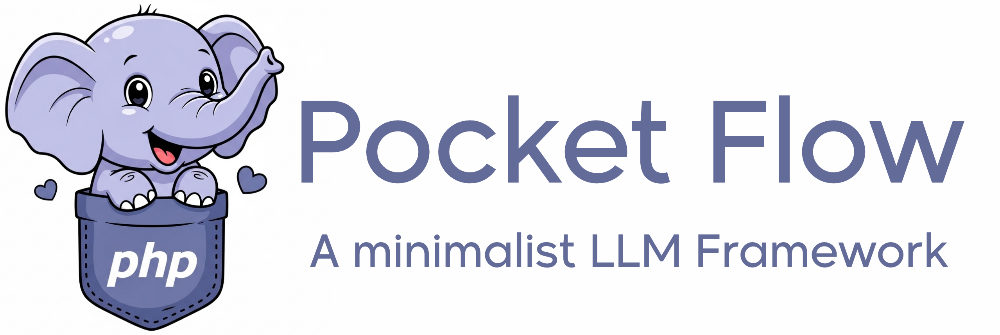

# PocketFlow-PHP
<p align="center">
  
</p>
<p align="center">
  <strong>A minimalist LLM framework for PHP, inspired by the 100-line Python original].</strong>
  <br>
  Build complex Agents, Workflows, RAG systems and more, with a tiny, powerful core.
</p>

<p align="center">
  <a href="https://github.com/weise25/PocketFlow-PHP/blob/main/LICENSE"></a>
  <a href="#"></a>
  <a href="https://packagist.org/packages/react/async"></a>
</p>

---

**PocketFlow-PHP** is a port of the amazing 100-line Python LLM framework from [Zachary](https://github.com/The-Pocket/PocketFlow), bringing its core principles to the PHP ecosystem. It's designed for developers (and AI Agents!) who want maximum control and flexibility without the bloat of larger frameworks. It is optimized for **Agentic Coding**, where you design the system and an AI agent writes the code.

-   **Lightweight**: The entire framework core is in a single, well-tested file.
-   **Expressive**: Build everything you love from larger frameworks—Multi-Agent systems, RAG pipelines, and complex workflows—using simple, composable building blocks.
-   **Agentic-Coding Ready**: The structure is so intuitive that AI agents can assist in building complex LLM applications, following a clear set of rules defined in files like `GEMINI.md`, `.cursorrules`, etc.

## How does it work?

Just like in the original, the core abstraction is a **Graph + Shared Store**.

1.  **Node**: The smallest unit of work (e.g., call an LLM, read a file).
2.  **Flow**: Connects Nodes into a graph. Transitions are determined by simple string "Actions".
3.  **Shared Store**: A simple `stdClass` object passed through the entire flow, allowing nodes to communicate and share state.

This simple model is all you need to create powerful design patterns.

## Getting Started in 60 Seconds

Get up and running with your first AI-powered application.

**Prerequisites:** PHP 8.3+ and [Composer](https://getcomposer.org/) must be installed.

1.  **Clone the repository:**
    ```bash
    git clone https://github.com/weise25/PocketFlow-PHP.git
    cd PocketFlow-PHP
    ```

2.  **Install dependencies:**
    ```bash
    composer install
    ```

3.  **Set up your environment:**
    -   Create a `.env` file in the root of the project.
    -   Add your API keys to the `.env` file (e.g., `OPENROUTER_API_KEY=...`).

You are now ready to start building with an AI agent!

## Agentic Coding with PocketFlow-PHP

This project is designed to be used with an AI coding assistant like Claude Code, Cursor, Cline, etc. The AI will write the code based on your high-level instructions.

### 1. Verify the AI's Context

Open the project in your AI-powered editor or terminal. To ensure the agent understands the framework's rules, send it a simple test prompt:

> **Your Prompt:** "Help me explain briefly what PocketFlow-PHP is."

The agent should respond with a summary based on the project's documentation. This confirms it has the correct context.

### 2. Describe Your Goal

Now, give the agent a high-level description of what you want to build. You design, the agent codes.

> **Example Prompt for our Quiz Show:**
>"I have an idea for a fun CLI app: a 'Who Wants to be a Millionaire?' style quiz show with AI agents. We need a Quizmaster agent to host the show and ask trivia questions. Then, we need two Player agents to compete against each other by answering the questions. The Quizmaster should evaluate the answers, keep score, and end the game after a few rounds. Please use the OpenRouter API with free models for all three agents."

### 3. Let the Agent Work

The AI agent will now:
1.  Propose a plan.
2.  Ask for your confirmation.
3.  Generate the code in the correct files (`nodes.php`, `flow.php`, `main.php`, and `utils/`).

Your job is to guide, confirm, and test the final result.

### See it in Action

Check out the completed **[Multi-Agent Quiz Show](https://github.com/weise25/PocketFlow-PHP/tree/main/examples/quiz-show-multi-agent)** in the `/examples` to see a finished project and test it for yourself.

## Why This Approach?

By providing a clear structure and a strict set of rules (e.g., in `GEMINI.md`, `CLAUDE.md`, `.cursorrules`), we minimize common AI errors and allow the agent to focus on what it does best: translating logic into code. This dramatically speeds up development and lets you build complex systems with simple, natural language prompts.

<p align="center">
  <strong>Ready to build? Open your AI assistant and start creating.</strong>
</p>
