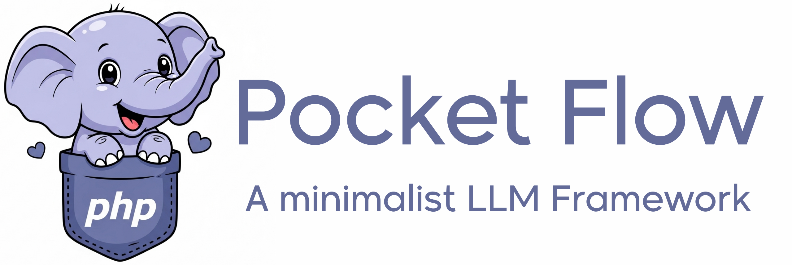

# PocketFlow-PHP

<p  align="center">



</p>

<p  align="center">

<strong><p align="center">A minimalist LLM framework for PHP, inspired by the 100-line Python original.</strong>

<br>

<p align="center">Build complex Agents, Workflows, RAG systems and more, with a tiny, powerful core.</p>

</p>

  


<p align="center">
  <a href="https://github.com/weise25/PocketFlow-PHP/blob/main/LICENSE"></a>
  <a href="#"></a>
  <a href="https://packagist.org/packages/react/async"></a>
</p>

  

---

  

**PocketFlow-PHP** is a port of the amazing 100-line Python framework [PocketFlow](https://github.com/The-Pocket/PocketFlow) from [Zachary](https://github.com/zachary62/), bringing its core principles to the PHP ecosystem. It's built for **Agentic Coding** — you design the system, an AI agent writes the code.

  

-  **Lightweight**: ~700 lines of clean PHP across 14 PSR-4 files.

-  **Expressive**: Multi-Agent systems, RAG pipelines, Workflows, Map-Reduce — all from simple composable building blocks.

-  **Agentic-Coding Ready**: Ships with an Agent Skill (`.agents/skills/pocketflow-php/`) that makes any AI coding tool instantly fluent in the framework.

  

## How does it work?

  

The core abstraction is a **Graph + Shared Store**:

  

1.  **Node**: Smallest unit of work — `prep()` → `exec()` → `post()`, with built-in retry/fallback.

2.  **Flow**: Connects Nodes into a directed graph. String "Actions" determine transitions.

3.  **Shared Store**: A `SharedStore` object passed through the entire flow for inter-node communication.

  

From these three primitives you build every design pattern: Agent, Workflow, RAG, Map-Reduce, Multi-Agent, and more.

  

## Quick Start

  

Build your own app in 60 seconds using the template:

  

```bash
git clone https://github.com/weise25/pocketflow-php-template.git my-app

cd my-app

composer install
```

Open in any AI coding tool that supports the [Agent Skills](https://agentskills.io) standard — **Cline**, **Cursor**, **Windsurf**, **Claude Code**, **OpenCode**, and others. The built-in skill automatically teaches your agent the framework.

  

Then just describe what you want to build:

  

>  *"Build me a research agent that searches the web and synthesizes a report."*

  

The agent will write `nodes.php`, `flow.php`, `main.php`, and `utils/` — following the 8-step Agentic Coding process.

  

## Installing in an Existing Project

  

```bash
composer require weise25/pocketflow-php
```

```php

use  PocketFlow\Node;

use  PocketFlow\Flow;

use  PocketFlow\SharedStore;

// etc.

```

  

## Examples

| Example | Pattern | Description |
|---|---|---|
| [Web Search Agent](examples/web-search-agent) | Agent | Multi-step research with Brave Search + OpenRouter |
| [Multi Agent Quiz Show](examples/quiz-show-multi-agent) | Multi-Agent | Three AI agents — a host and two contestants — play a quiz game |
| [Simple Text-to-CV](examples/text-to-cv-with-frontend) | Workflow + Frontend | Generate a CV plan, iterate with edits, output PDF |
  
## Upgrading from 0.1.x

Version 0.2.0 introduced these breaking changes:

1.  **Replace `stdClass` with `SharedStore`**: All `run()`, `prep()`, `post()` etc. now expect `PocketFlow\SharedStore` instead of `stdClass`. Change `new stdClass()` to `new SharedStore()` and update type hints.

2.  **Async methods renamed**: `run_async()` → `runAsync()`, `prep_async()` → `prepAsync()`, `exec_async()` → `execAsync()`, `post_async()` → `postAsync()`, `exec_fallback_async()` → `execFallbackAsync()`.

3.  **Exception handling**: The framework now throws `LogicException` or `RuntimeException` instead of issuing `E_USER_WARNING`.

4.  **Namespaces**: All classes now live in the `PocketFlow\` namespace. Add `use PocketFlow\Node;` etc. to your files.

5.  **PSR-4 structure**: Classes are now one-per-file instead of a single `PocketFlow.php`.

  

## Why This Approach?

  

PocketFlow-PHP doesn't try to be a massive framework with every feature built in. It provides the graph abstraction, the retry mechanism, and the async backbone — then gets out of your way. Utility functions (LLM calls, web search, embedding) are yours to write or swap. This keeps the core tiny, portable, and vendor-agnostic.

  

Paired with an AI coding agent, the framework's strict structure eliminates common LLM errors and lets the agent focus on translating your intent into code — at dramatic speed.

  

<p  align="center">

<strong>Ready to build? Clone the template and start creating.</strong>

</p>
