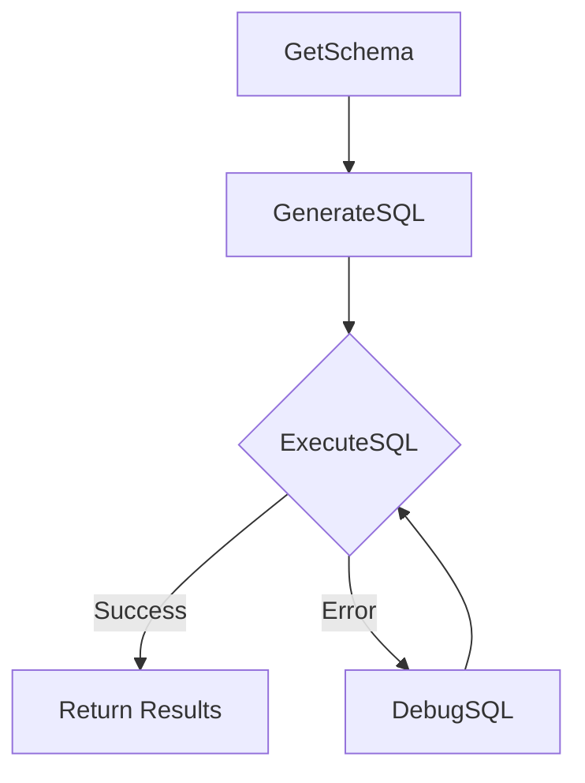

# Text-to-SQL

*Convert natural language into SQL, powered by LLMs and PocketFlow-PHP.*

Take any English question about an ecommerce database and get real SQL results — with an automatic debugging loop that fixes failed queries on the fly.

---

## Features

- **Natural language to SQL** — ask questions in plain English, get back database results
- **LLM-powered debugging** — failed SQL queries are automatically corrected and retried (up to a configurable limit)
- **Interactive TUI** — REPL with command history, autocomplete, and ANSI color output
- **Any OpenAI-compatible provider** — works with OpenRouter, OpenAI, DeepSeek, or any compatible API via `.env` config
- **Auto-populating database** — sample ecommerce database (customers, products, orders, order_items) created on first run

---

## Quick Start

```bash
# 1. Install dependencies
composer install

# 2. Configure your LLM provider
cp .env.example .env
# Edit .env and add your API key

# 3. Run
php main.php "show total revenue per product category"
```

---

## Interactive TUI

Run without arguments for a full REPL experience:

```bash
php main.php
```

```
╔══════════════════════════════════════════════╗
║  Text-to-SQL REPL                           ║
║  Ecommerce database — ask questions in plain ║
║  English and get real SQL results.           ║
╠══════════════════════════════════════════════╣
║  /help      Show this help                  ║
║  /schema    Show database schema            ║
║  /retries N Set max debug retries (default 3)║
║  /exit      Quit                            ║
╚══════════════════════════════════════════════╝

text2sql> show products priced over $100

┌─ Results ─────────────────────────────────────────────────
│ name           │ price
├───────────────────┼────────
│ Laptop Pro     │ 1200.00
│ 4K Monitor     │ 350.00
│ Smartphone X   │ 999.00
└────────────────────────────────────────────────────────────

text2sql> /exit
```

### REPL Commands

| Command | Action |
|---------|--------|
| `query text` | Ask a question and get SQL results |
| `/help` | Show available commands |
| `/schema` | Display the database schema |
| `/retries N` | Set max debug attempts (0 to disable) |
| `/exit` | Quit |

History and autocomplete are supported via readline (up arrow to recall previous queries).

---

## Configuration

All LLM settings live in `.env`:

```env
LLM_BASE_URL=https://openrouter.ai/api/v1
LLM_MODEL_ID=deepseek/deepseek-v4-flash
LLM_API_KEY=sk-or-v1-your-key-here
```

Works with any OpenAI-compatible API — just change `LLM_BASE_URL`, `LLM_MODEL_ID`, and `LLM_API_KEY` to match your provider.

---

## How It Works



The workflow uses four PocketFlow nodes connected in a linear pipeline with an embedded debugging loop:

1. **GetSchema** — Reads the SQLite database schema (tables, columns, types)
2. **GenerateSQL** — Sends schema + question to the LLM, parses the SQL from YAML output
3. **ExecuteSQL** — Runs the generated SQL against the database
4. **DebugSQL** — If execution fails, sends the error + failed SQL + context back to the LLM for correction

Failed queries loop through DebugSQL → ExecuteSQL up to `maxDebugAttempts` times before giving up.

In REPL mode, the schema is extracted once and cached — subsequent queries skip GetSchema for faster responses.

---

## Project Structure

```
.
├── main.php              # Entry point — one-shot or interactive TUI
├── nodes.php             # Node classes: GetSchema, GenerateSQL, ExecuteSQL, DebugSQL
├── flow.php              # Flow wiring — full flow + query-only flow
├── utils/
│   ├── callLlm.php       # LLM API wrapper (cURL, any OpenAI-compatible endpoint)
│   └── populateDb.php    # Ecommerce database creation (idempotent)
├── docs/
│   └── design.md         # Detailed design document
├── .env.example          # Configuration template
├── composer.json
```

---

## The Database

A sample ecommerce database with 4 tables:

| Table | Rows | Description |
|-------|------|-------------|
| `customers` | 10 | Name, email, city, registration date |
| `products` | 10 | Name, category, price, stock |
| `orders` | 20 | Customer orders with status and shipping |
| `order_items` | ~50 | Line items per order with quantity and price |

---

## Example Queries

Try these in the REPL:

```
show all customers from New York
which products have stock under 100?
total revenue by product category
list orders that are still pending with customer names
what is the average order value?
```
