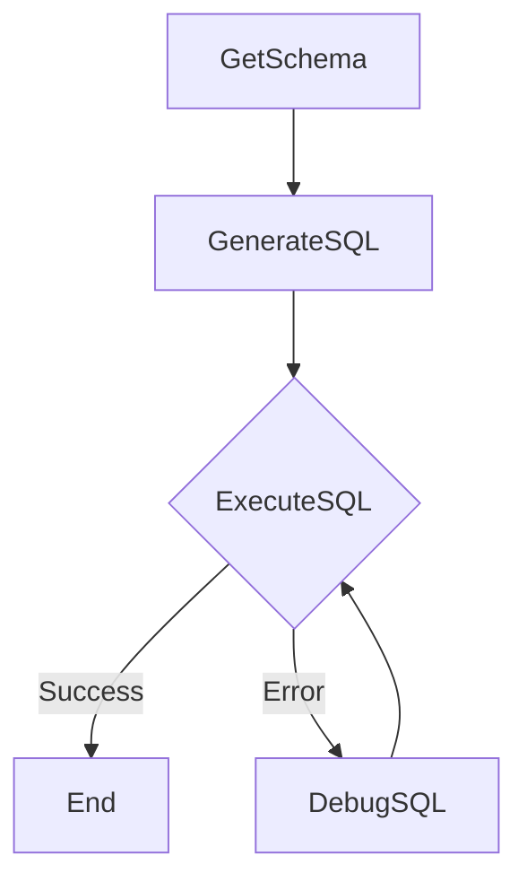

# Design Doc: Text-to-SQL Agent (PHP)

## Requirements

The system should take a natural language query and a path to an SQLite database as input. It should then:
1. Extract the schema from the database.
2. Generate an SQL query based on the natural language query and the schema.
3. Execute the SQL query against the database.
4. If the SQL execution fails, attempt to debug and retry the SQL generation and execution up to a specified maximum number of attempts.
5. Return the final results of the SQL query or an error message if the process fails.

## Flow Design

### Applicable Design Pattern

The primary design pattern is a **Workflow** with an embedded **Agent**-like behavior for debugging.
- **Workflow**: The process follows a sequence: GetSchema → GenerateSQL → ExecuteSQL.
- **Agent (for Debugging)**: If `ExecuteSQL` fails, the `DebugSQL` node acts like an agent, taking the error and previous SQL as context to generate a revised SQL query. This forms a loop back to `ExecuteSQL`.

### Flow Diagram



## Utility Functions

1. **Call LLM** (`utils/callLlm.php`)
   - *Input*: `prompt` (string)
   - *Output*: `response` (string) — raw LLM response text
   - *Necessity*: Used by `GenerateSQL` and `DebugSQL` nodes
   - *Provider*: Any OpenAI-compatible API endpoint, configured via `.env`
   - *Implementation*: cURL POST to `{LLM_BASE_URL}/chat/completions`
   - *Throws*: `RuntimeException` if any required env var is missing or on HTTP failure

2. **Populate DB** (`utils/populateDb.php`)
   - *Input*: database file path (string)
   - *Output*: None (creates/populates in place)
   - *Necessity*: Creates sample ecommerce database on first run
   - *Behavior*: Idempotent — drops existing database before recreating

## Environment Configuration

All LLM configuration is in `.env` (gitignored). A `.env.example` template is committed for reference.

| Key | Required | Example |
|-----|----------|---------|
| `LLM_BASE_URL` | Yes | `https://openrouter.ai/api/v1` |
| `LLM_MODEL_ID` | Yes | `deepseek/deepseek-v4-flash` |
| `LLM_API_KEY` | Yes | `sk-or-v1-...` |

All three are required. Missing any throws `RuntimeException` at call-time.

## Node Design

### SharedStore Schema

```
shared {
    dbPath           → (input)   string — path to SQLite database
    naturalQuery     → (input)   string — user's natural language question
    maxDebugAttempts → (input)   int — max retries for debug loop (default 3)
    debugAttempts    → (internal) int — current retry count
    schema           → GetSchema output — string, formatted schema
    generatedSql     → GenerateSQL / DebugSQL output — string, SQL query
    executionError   → ExecuteSQL error — string, SQLite error message
    finalResult      → ExecuteSQL success — array, query result rows or message
    resultColumns    → ExecuteSQL success — array, column names (SELECT only)
    finalError       → terminal error — string, set when max retries exhausted
}
```

### Node Steps

1. **`GetSchema`**
   - *Type*: Regular (`Node`)
   - *`prep`*: Reads `dbPath` from shared store.
   - *`exec`*: Connects to SQLite via PDO, queries `sqlite_master` for tables, then `PRAGMA table_info(table_name)` for each table's columns. Builds formatted schema string.
   - *`post`*: Writes `schema` to shared store. Returns `"default"` → `GenerateSQL`.

2. **`GenerateSQL`**
   - *Type*: Regular (`Node`) with retry (`maxRetries: 2`, `wait: 1`)
   - *`prep`*: Reads `naturalQuery`, `schema` from shared store.
   - *`exec`*: Builds LLM prompt with schema + question, requesting YAML-structured output with `sql:` key. Calls `callLlm()`. Parses YAML response (via `symfony/yaml`) to extract SQL. Strips trailing semicolon.
   - *`post`*: Writes `generatedSql` to shared store. Resets `debugAttempts = 0`. Returns `"default"` → `ExecuteSQL`.

3. **`ExecuteSQL`**
   - *Type*: Regular (`Node`)
   - *`prep`*: Reads `dbPath`, `generatedSql` from shared store.
   - *`exec`*: Connects to SQLite via PDO, executes SQL. For SELECT/WITH: fetches result rows + column names. For DML/DDL: commits and returns row count. Returns `[bool $success, mixed $result, array $columns]`.
   - *`post`*:
     - Success: Stores `finalResult`, `resultColumns`. Returns `null` (flow ends).
     - Failure: Stores `executionError`. Increments `debugAttempts`. If `< maxDebugAttempts`: returns `"error_retry"` → `DebugSQL`. Otherwise: stores `finalError`, returns `null` (flow ends).

4. **`DebugSQL`**
   - *Type*: Regular (`Node`) with retry (`maxRetries: 2`, `wait: 1`)
   - *`prep`*: Reads `naturalQuery`, `schema`, `generatedSql` (failed), `executionError` from shared store.
   - *`exec`*: Builds debug prompt with failed SQL, original question, schema, and error. Calls `callLlm()`. Parses YAML response for corrected SQL.
   - *`post`*: Overwrites `generatedSql` with corrected SQL. Removes `executionError`. Returns `"default"` → `ExecuteSQL` (loop back).

## Flow Wiring

```php
GetSchema >> GenerateSQL >> ExecuteSQL
ExecuteSQL -"error_retry" >> DebugSQL
DebugSQL >> ExecuteSQL
```

- `>>` = default transition (matches `"default"` or `null` return from `post()`)
- `-"error_retry">>` = conditional transition (matches `"error_retry"` return from `post()`)
- Return `null` from `ExecuteSQL.post()` stops the flow (success or max retries reached)

## Dependencies

In `composer.json`:
```
php: >=8.3
weise25/pocketflow-php: ^0.2
vlucas/phpdotenv: ^5.6
symfony/yaml: ^7.0
ext-pdo: *
ext-pdo_sqlite: *
```
